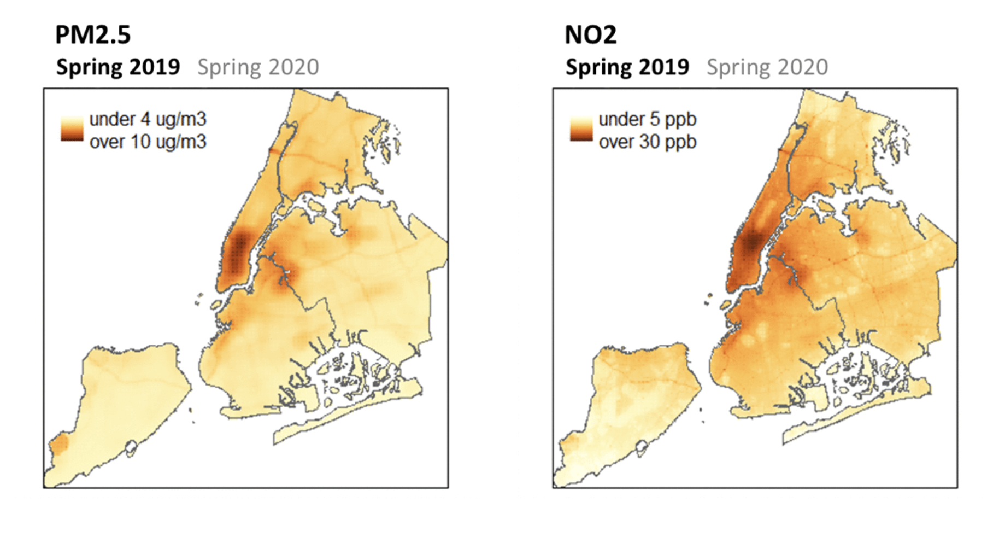

At the Environment and Health Data Portal, our mission is to make data easy to understand, access, and use. These principles extend to how we approach digital accessibility. New York City’s Local Law 26 requires City agencies to make their websites accessible. But this isn’t just a requirement — it’s also the best way we can serve our public. While there is no one-size-fits-all solution to digital accessibility since access needs can be as unique as people, we can take approaches that help our information reach a wider range of users.

**Making information digitally accessible can include lots of different techniques:**

- Adding alt text to images to describe them for visually impaired users
- Adding captions to audio for hearing impaired users
- Checking that contrast is adequate between colors so that colorblind users can identify distinct areas in maps and charts

Recently, we worked to improve the accessibility of data visualizations in key areas to ensure that they are accessible to people who use screen readers. A screen reader is software that reads content out loud; many blind or visually impaired people use them to interact with computers.

Many data visualizations are inaccessible: screen readers can't navigate and read them in a way that explains the data to the user. But, a screen reader can read a properly-formatted table. So, complementing inaccessible data visualizations with properly formatted tables (with descriptive labels for headers and rows) can offer users of screen readers access to the data.

### Tailoring tables to match data visualizations

There are many different types of data visualizations, like line charts, chloropleth maps, bar charts, locator maps, and more. Creating tables to complement these visualizations requires a strategic approach, to meaningfully communicate the data.

**The first things we ask ourselves when creating an accessible table are:**

1. What are we trying to communicate with this chart?
2. Why did we choose this kind of chart?

As we answer this, we sometimes organize and label the data in the table different than we do for the data visualization.

By bringing these to the fore, our accessible tables are more likely to match the meaning of our data visualizations. We’ll go through a few examples of how we’ve implemented this approach to translate the intent of data visualizations into a non-visual format.

### Line charts: creating back-up tables

In some cases, creating a table that communicates the meaning behind a trend chart is straightforward.

<iframe title="Lead poisoning in NYC adults" aria-label="Interactive line chart" id="datawrapper-chart-i7Bgo" src="https://datawrapper.dwcdn.net/i7Bgo/4/" scrolling="no" frameborder="0" style="border: none;" width="100%" height="515" data-external="1"></iframe>

In the case of this [trend chart comparing falling lead poisoning rates in NYC adults across the five boroughs](../../data-stories/adult-lead/), we duplicated the underlying data and formatted it as a table. Here, the year, blood lead levels, and borough headers guide users through the information.

<iframe title="Lead poisoning rates in adult New Yorkers have fallen since 2001" aria-label="Table" id="datawrapper-chart-c7jtG" src="https://datawrapper.dwcdn.net/c7jtG/5/" scrolling="no" frameborder="0" style="width: 0; min-width: 100% !important; border: none;" height="739" data-external="1"></iframe>

Typically, we add code that prevents screen readers from encountering inaccessible visualizations, and we hide the accessible tables from sighted users. So, we wind up presenting the same information, but tailored to the ways different users interact with their computer.

### Point maps: revising information in back-up tables

<iframe title="NYCCAS monitor locations" aria-label="Map" id="datawrapper-chart-d7DDS" src="https://datawrapper.dwcdn.net/d7DDS/2/" scrolling="no" frameborder="0" style="width: 0; min-width: 100% !important; border: none;" height="656" data-external="1"></iframe>

Here the symbol map using point data from our data story [Breathe easy: NYC’s air quality is improving](../../data-stories/breatheeasy/), works well in a visual context, where sighted users can gather information about which air quality monitoring sites are located throughout NYC.

The air quality sites are overlaid onto this point map using latitude and longitude coordinates, and corresponding site IDs. But when we made a table with these data, we realized we were delivering information that is less meaningful in a non-visual context to our screen-reader users.

<iframe title="NYCCAS monitor locations" aria-label="Table" id="datawrapper-chart-dB6XN" src="https://datawrapper.dwcdn.net/dB6XN/3/" scrolling="no" frameborder="0" style="width: 0; min-width: 100% !important; border: none;" height="892" data-external="1"></iframe>

<em>Screen-reader accessible table with zip codes instead of coordinates</em>

The point map shows sighted people where the monitors are, using latitude and longitude. But most people can't parse latitude and longitude and understand where a monitor is - so, a table that just shows each monitor's coordinates doesn't work as well as the map does. So, to provide a sense of where these monitors are located, we added the parent ZIP Code of each monitor th the table. These are more common in daily life, and can more easily give somebody a sense of where the monitor is.

### When there's too much data for a table

In some cases, tables wouldn’t add much meaningful context for a screen reader. Raster maps show data on a grid of small pixels – more than 80,000 for NYC. The pixels allow us to see nuanced gradations in data values by seeing where pixels are denser and deeper colors. In this example, [some users can observe that the concentration of two air pollutants, NO2 and PM2.5, decreased as traffic and commercial cooking decreased](../../data-stories/air-quality-and-covid/) during the first year of the COVID-19 pandemic.

But providing somebody with a table of tens of thousands of x-y coordinates and values wouldn't communicate what these data show. So, we add descriptive alt text that explains the visualization's major takeaways about how air pollution changed during the COVID-19 pandemic.

Similar to translating the locations of air quality monitoring sites, we have lots of information - and it's important to provide both access to the right kind of information for different users.

 

There are many interpretations of accessibility, and these examples are just a few strategies we used when thinking through how to improve access to the information we share, to in turn make it easier for more of you to understand and use.
