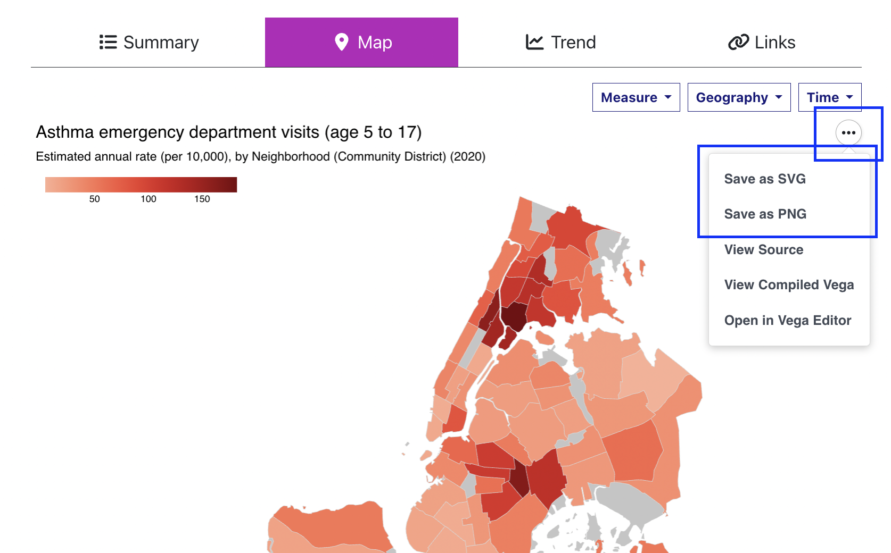
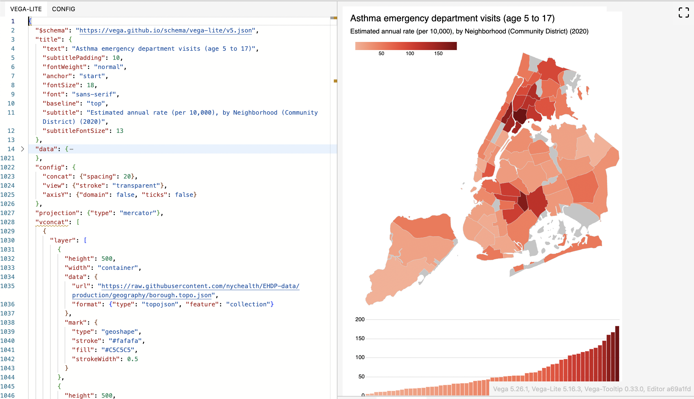
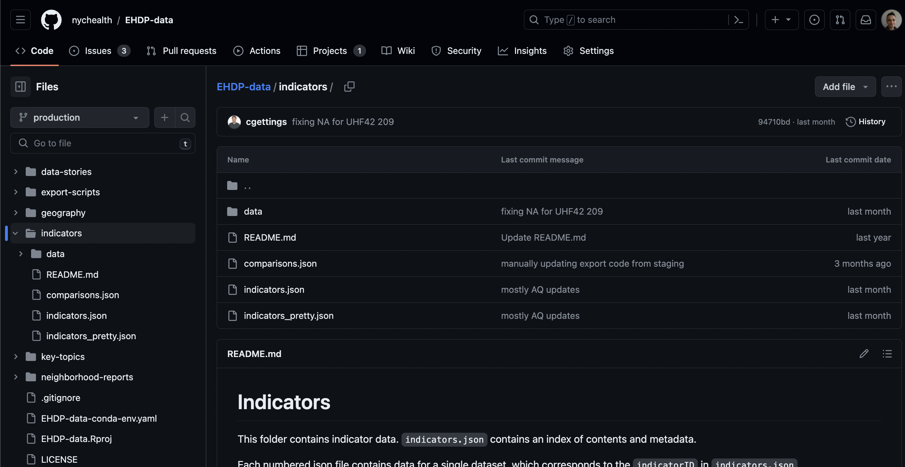

If you are a data scientist, programmer, open data enthusiast, open source evangelist, data visualiation specialist or somebody who aspires to be any of those, then there are some advanced features of the Environment and Health Data Portal that you can use to get and use our data.

## Re-use data visualizations

The visualizations on our site's [Data Explorer](../../data-explorer/) use a JavaScript library called [Vega-Lite](https://vega.github.io/vega-lite/). Vega-lite provides a few options for you to use the visualizations in other contexts.

Above and to the right of the visualiaztions, there's a three-dot menu. Clicking this gives you a few helpful options:

**Save as SVG** or **Save as PNG** will trigger a download of the visualization as an image. You can re-use this in other material. (When you re-use our visualizations, please provide credit/attribution to the NYC Health Department / Environment and Health Data Portal.)

**Open in Vega Editor** will open a new tab with the visualizations specification loaded in the Vega Editor, an online widget that lets you modify and run visualizations in Vega-Lite. This lets you edit a version of the visualization's code, revise it, preview it, ensure that you have working code which you can then embed in your own website using the `vegaEmbed` function. [For details about how to embed Vega-Lite visualizations into another webpage, see the Vega-Lite documentation](https://vega.github.io/vega-lite).

The specification is on the left, and you can edit the layout and design details of the visualization that gets rendered on the right. It can take a bit of learning to properly edit a Vega-Lite spec. [Vega-Lite's documentation will help](https://vega.github.io/vega-lite/docs/). 

## Download data 
Below each data visualization, there is a "Download data" button that lets you download what you're seeing:
- For the table, this will download the full table of data
- For the map, it will trigger a download of the data for whichever geographic resolution is being shown
- For the trend chart, it will download the years and geographies displayed
- For the links & disparities charts, it will download both indicators at the geography displayed

You can use these data for your own projects. It may be helpful to retain information on the Data Source and About The Measures (which explains how the indicator was calculated) fields displayed on each indicator's page. 

## Directly access underlying data
You can bypass ourwebsite and get data by going to [our data repository](https://github.com/nychealth/EHDP-data). The Data Explorer's data is stored in [`/indicators`](https://github.com/nychealth/EHDP-data/tree/production/indicators). Some documentation is available in that location's Readme, but briefly:
- `metadata.json` contains the indicators' names, indicator IDs (used to identify which file the data are in), data sources, notes, and other visualization specifications used by the site code.
- The `/data` folder contains a .json file for each indicator, with fields for the measure ID, geography, time period, value, and a few other supplemental fields.

To help find specific datasets (indicators) in `metadata.json`, [you can search by text on our Indicator Catalog page](../../data-explorer/indicator-catalog/)

## Use the site's source code for your own project
[The entire source code for this website is stored in a publicly-available Github repository](https://github.com/nychealth/EH-dataportal/). This means you can:
- File issues if you have questions about the site
- View the underlying source code
- Download the source code and modify it to create your own site.

Using the source code will require a basic understanding of [npm](https://www.npmjs.com/) and a functional understanding of [Hugo](https://gohugo.io/), the static site builder used to create this site (there are excellent video tutorials for both available on Youtube). At the most basic, you need to have npm and Hugo installed on your computer. After that, run `npm install` in your local repository to install the depenedencies that the site needs, and `Hugo serve` to serve a local version of the site so you can preview your changes.

Modifying the source code will require some understanding of Hugo. For using the Data Explorer application to build your own data visualization website, you'll need extensive knowledge of JavaScript and functional knowledge of [DataTables.net](https://www.datatables.net), [Vega-Lite](https://vega.github.io/vega-lite/), and [Arquero](https://uwdata.github.io/arquero/). How the Data Explorer works is closely tied to how the data are structured - you will need a metadata file and indicators structured the same way that ours are, and you'd need to revise references to the data locations so that your Data Explorer application will properly display your data. 

---
 
The purpose of this website is to make data easier to access, understand, and use - and we hope that working with open source technology ("working in the open") can also help with this, either by making it easier for people to use the data and visualizations, or for you to learn from this project and do similar work at your agency. <a href="mailto:ehdp@health.nyc.gov">Feel free to email us if you have any questions</a> - we're always happy to talk or to help.