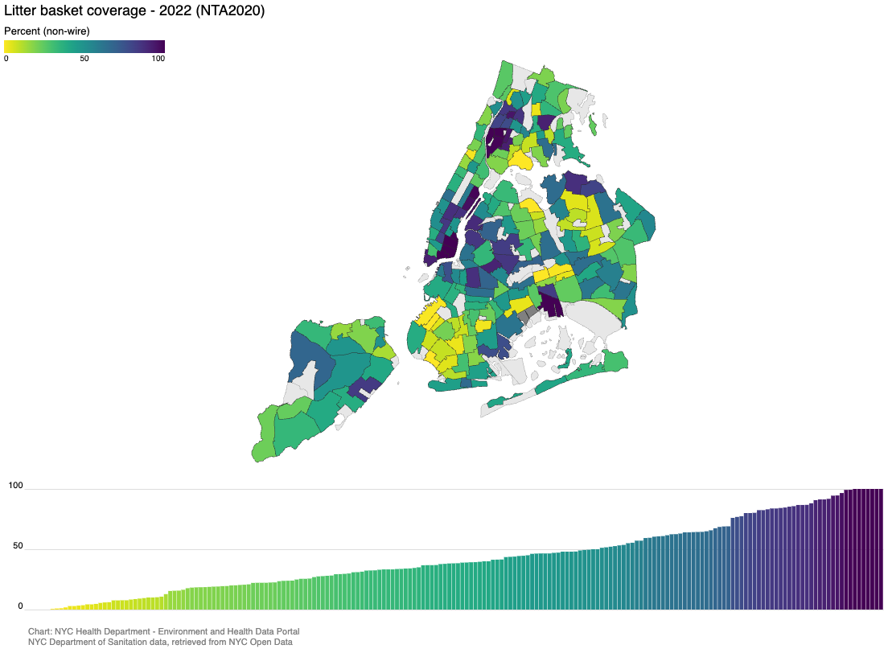

The Environment and Health Data Portal hosts over 200 sets of measures from data sources that cover topics like air quality, climate, pests, housing, and much more. These data can tell us how environmental factors like housing, air quality, and socioeconomic status can shape health from neighborhood to neighborhood. But where does this data come from? How often is it updated? And how do we pick which datasets to feature?

## Where do you get your data?

We get data from many sources: some from the NYC Health Department or other city agencies like <a href="https://www.nycgovparks.org/">NYC Parks</a> or <a href="https://www.nyc.gov/site/doi/index.page">Department of Investigations</a>; and some from outside sources, like the [CDC](https://www.cdc.gov/), [SPARCS](https://www.health.ny.gov/statistics/sparcs/), the [U.S. Census](https://www.census.gov/), and the [EPA](https://www.epa.gov/). Here are some of the core datasets:

  

    <a class="card-header collapse collapsed font-weight-bold" id="acc-button-2a" data-toggle="collapse" href="#panel-acc-button-2a"  role="tab" aria-expanded="false" aria-controls="panel-acc-button-2a">
      <i class="fa-solid fa-clipboard-list"></i> Community Health Survey
    </a>

  

    

<strong><a href="https://www.nyc.gov/site/doh/data/data-sets/community-health-survey.page">What is the Community Health Survey (CHS)?</a></strong> This survey is conducted by the NYC Health Department and interviews about 10,000 New Yorkers each year. Running since 2002, CHS reports detailed data on many chronic diseases and health behaviors, helping us see trends at the neighborhood, borough, and citywide level.  
        <strong>Some CHS indicators include:</strong>
        <ul>
        <li><a href="../../data-explorer/mental-health/?id=2417">Mental health: Adults with depression</a></li>
        <li><a href="../../data-explorer/economic-conditions/?id=2132">Health care: Adults with health insurance</a></li>
        <li><a href="../../data-explorer/asthma/?id=18">Asthma: Adults with a recent asthma attack</a></li>
        <li><a href="../../data-explorer/physical-activity/?id=2060">Physical activity: Recent exercise</a></li>
        </ul>
      <strong>What we use it for: </strong>CHS data helps us track the health of New Yorkers and connect the dots between health behavior and health status. This helps us prioritize programs where they matter most. If we see, for example, that there are fewer adults with a doctor in West Queens, we can try to address that through campaigns and outreach. Or if there are more adults with a recent asthma attack in the South Bronx, we can communicate with healthcare providers, neighborhood centers, and schools to provide resources and and education, prevention, and mitigation plans.

    

  

  <!-- .collapse -->
  

  <!-- .card (end of first accordion, repeat as needed) -->

  

      <a class="card-header collapse collapsed font-weight-bold" id="acc-button-2b" data-toggle="collapse" href="#panel-acc-button-2b"  role="tab" aria-expanded="false" aria-controls="panel-acc-button-2b">
        <i class="fa-solid fa-hospital"></i> Statewide Planning and Research Cooperative System
      </a>

    

<strong><a href="https://www.health.ny.gov/statistics/sparcs/">What is New York Statewide Planning and Research Cooperative System (SPARCS)?</a></strong> SPARCS is a billing claims data system that collects patient-level data, like diagnoses, treatments, and characteristics for both inpatient and outpatient stays in every hospital throughout New York state. It is a collaboration between the NY state government and the healthcare system. At the NYC Health Department, we restrict data to hospitals within NYC and sometimes to NYC residents.  
  <strong>Some SPARCS indicators include: </strong>
    <ul>
    <li><a href="../../data-explorer/weather-related-illness/?id=2376">Heat-stress hospitalizations and emergency department visits</a></li>
    <li><a href="../../data-explorer/mental-health/?id=2418">Psychiatric hospitalizations</a></li>
    <li><a href="../../data-explorer/asthma/?id=2382">Asthma hospitalizations</a></li>
    <li><a href="../../data-explorer/transportation-related-injuries/?id=2086">Bicycle injury hospitalizations</a></li>
    </ul>
  <strong>What we use it for:</strong> Patient-level data from healthcare facilities can help us understand how environmental factors (for example, hot days and socioeconomic status) relate to health outcomes (like heat-related hospitalizations among different demographics). These data help us characterize severity and risk factors for different populations.

<!-- .collapse -->

  

      <a class="card-header font-weight-bold collapse collapsed" id="acc-button-2c" data-toggle="collapse" href="#panel-acc-button-2c"  role="tab" aria-expanded="false" aria-controls="panel-acc-button-2c">
        <i class="fa-solid fa-house"></i> Housing and Vacancy Survey
      </a>

    

<strong><a href="http://census.gov/programs-surveys/nychvs.html">What is the Housing and Vacancy Survey (HVS)?</a></strong> The NYC Department of Housing Preservation and Development (HPD) and the US Census Bureau together conduct the HVS every 3 years. The main purpose of HVS is to describe how many rental units are vacant to understand more about rent control and stabilization and the housing market.  
        <strong>Some HVS indicators include: </a></strong>
          <ul>
          <li><a href="../../data-explorer/housing-maintenance/?id=40">Homes with cracks or holes</a></li>
          <li><a href="../../data-explorer/housing-maintenance/?id=2446">Homes with mold</a></li>
          <li><a href="../../data-explorer/housing-safety/?id=2185">Household air conditioning<a></li>
          <li><a href="../../data-explorer/housing-stability/?id=2336">Rent-burdened households</a></li>
          </ul>
        <strong>What we use it for:</strong> It helps us understand the state and quality of our available housing, which ties into important health outcomes. HVS data about housing issues that affect health can help us connect these issues to other disparities and inequities across NYC, like income, health care, heat and cold vulnerability and more.

<!-- .collapse -->

  

      <a class="card-header font-weight-bold collapse collapsed" id="acc-button-2d" data-toggle="collapse" href="#panel-acc-button-2d"  role="tab" aria-expanded="false" aria-controls="panel-acc-button-2d">
        <i class="fa-solid fa-clipboard-list"></i> American Community Survey
      </a>

    

<strong><a href="https://www.census.gov/programs-surveys/acs.html">What is the American Community Survey (ACS)?</a></strong> The US Census Bureau conducts the ACS annually, collecting population, housing, and workforce data like unemployment, income, insurance, and more.   
        <strong>Some ACS indicators include: </a></strong>
          <ul>
          <li><a href="../../data-explorer/social-conditions/?id=2146">Older adults living alone (65+)</li>
          <li><a href="../../data-explorer/social-conditions/?id=14">Foreign-born population</a></li>
          <li><a href="../../data-explorer/economic-conditions/?id=103">Neighborhood poverty</a></li>
          </ul>
        <strong>What we use it for:</strong> This data helps us understand the links between inequality, the social determinants of health, and health outcomes. ACS data on income is used to show, for example, how neighborhoods with higher levels of poverty tend to also have poorer quality housing, and have higher rates of many chronic diseases and premature death. 
            

<!-- .collapse -->

  

      <a class="card-header font-weight-bold collapse collapsed" id="acc-button-2e" data-toggle="collapse" href="#panel-acc-button-2e"  role="tab" aria-expanded="false" aria-controls="panel-acc-button-2e">
        <i class="fa-solid fa-smog"></i> NYCCAS
      </a>

    

<strong><a href="../../data-features/nyccas">What is the New York City Community Air Survey (NYCCAS)?</a></strong> Started in 2008, NYCCAS is the largest ongoing urban air monitoring program of any U.S. city. NYCCAS tracks air pollutants at the street-level, where people spend most of their time.   
        <strong>Some NYCCAS indicators include:</strong>
          <ul>
          <li><a href="../../data-explorer/air-quality/?id=2023">Concentration of fine particles (PM2.5)</a></li>
          <li><a href="../../data-explorer/air-quality/?id=2027">Ozone (O3)</a></li>
          <li><a href="../../data-explorer/air-quality/?id=2026">Sulfur dioxide (SO2)</a></li>
          </ul>
        <strong>What we use it for:</strong> It helps us inform PlaNYC, track changes in air quality over time, estimate exposures for health research, inform the public about local topics, such as air quality improvements, health benefits of public transit to air quality, and efforts to reduce the health impacts of air pollution.  

<!-- .collapse -->

  

      <a class="card-header font-weight-bold collapse collapsed" id="acc-button-2f" data-toggle="collapse" href="#panel-acc-button-2f"  role="tab" aria-expanded="false" aria-controls="panel-acc-button-2f">
        <i class="fa-solid fa-cake-candles"></i></i> Bureau of Vital Statistics
      </a>

    

<strong><a href="https://www.nyc.gov/site/doh/data/data-sets/vital-statistics-data.page">What is the Bureau of Vital Statistics?</a></strong>

Reporting all vital events in NYC since the 1800s, the NYC Bureau of Vital Statistics' records information about birth and death rates, infant mortality, and causes of death.
  
<strong>Some Bureau of Vital Statistics indicators include:</strong>

<ul>
<li><a href="../../data-explorer/mortality/?id=2322">Premature mortality</a></li>
<li><a href="../../data-explorer/mortality/?id=5">Death (infants)</a></li>
<li><a href="../../data-explorer/birth-outcomes/?id=4">Low birth weight at full term</a></li>
</ul>
<strong>What we use it for:</strong>
Vital stats data, like premature death rates, can help us get a snapshot of the general health of New Yorkers. When we analyze these data alongside social determinants of health, it can help us understand the burden of factors like neighborhood poverty on health outcomes. In one analysis, we found a <a href="../../data-features/minimum-wage">higher minimum wage could save thousands of lives</a>. We use cause of death records in our <a href="../../data-features/heat-report">annual heat mortality report</a>, to calculate how many deaths can be attributed to heat-related causes, and understand how race, income, and AC access shape vulnerability to heat-related illness and mortality.

<!-- .collapse -->

---

### What types of data sources are there?

There are many kinds of data, which are collected, cleaned, and updated in different ways. Here are some of the categories data can fall into, and some may even fall into multiple categories.

  

    <a class="card-header collapse collapsed font-weight-bold" id="acc-button-01" data-toggle="collapse" href="#panel-acc-button-01"  role="tab" aria-expanded="false" aria-controls="panel-acc-button-01">
      Regulatory data
    </a>

  

    

    

Collecting this type of data is mandated by the local, state, or federal government, which typically means it is updated regularly and reliably. In New York state, blood lead level testing is mandated. Because it is mandatory, it also means that blood lead levels of NYC populations are regularly updated, so there are many years of this data available. Still, not everyone goes to the doctor, even if testing is required. Federal air quality monitoring required by the Clean Air Act is another example of regulatory data.
    

    

  

  <!-- .collapse -->
  

  <!-- .card (end of first accordion, repeat as needed) -->

  

      <a class="card-header collapse collapsed font-weight-bold" id="acc-button-02" data-toggle="collapse" href="#panel-acc-button-02"  role="tab" aria-expanded="false" aria-controls="panel-acc-button-02">
        Survey data
      </a>

    

A selection of survey respondents answer questions online, via phone, or e-mail. Surveys like the Community Health Survey, the Housing and Vacancy Survey, and the American Community Survey are conducted regularly at different intervals. While most surveys are voluntary, some, like ACS, are compulsory.

Sometimes, a survey conducted every year drops a question, and we have to decide how to continue to track that dataset. In 2015, CHS dropped a question about recent cycling, so we looked for other indicators in both the CHS and ACS, with the goal of finding something with many years of data so we could see the change over time. We found <a href="../../data-explorer/physical-activity/?id=2059#display=summary">monthly bicycle use</a>, another survey question from CHS. The reliability of survey data depends on the willingness of respondents, as well as their honesty, the framing of the questions, and many other factors.

<!-- .collapse -->

  

      <a class="card-header font-weight-bold collapse collapsed" id="acc-button-03" data-toggle="collapse" href="#panel-acc-button-03"  role="tab" aria-expanded="false" aria-controls="panel-acc-button-03">
        Registry / population data
      </a>

    

Registry and population data is standardized information that must be collected about every person or event. This includes birth and death records, and Census data, which have all been recorded for a long time.

Premature mortality from the NYC Bureau of Vital Statistics and the US Census; or cancers in children from the New York State Cancer Registry both fall into this category.

<!-- .collapse -->

  

      <a class="card-header font-weight-bold collapse collapsed" id="acc-button-04" data-toggle="collapse" href="#panel-acc-button-04"  role="tab" aria-expanded="false" aria-controls="panel-acc-button-04">
        Near real-time data
      </a>

    

Collected continuously and systematically, near real-time data can include environmental data, like <a href="../data-features/realtime-air-quality">real-time air quality (PM2.5) monitoring</a>, which is updated hourly. It can also include near real-time health data, <a href="https://a816-dohbesp.nyc.gov/IndicatorPublic/data-features/heat-syndrome/">such as the total daily visits to the Emergency Department during the hot weather season</a>.

<!-- .collapse -->

  

      <a class="card-header font-weight-bold collapse collapsed" id="acc-button-05" data-toggle="collapse" href="#panel-acc-button-05"  role="tab" aria-expanded="false" aria-controls="panel-acc-button-05">
        Other types of data and Open Data
      </a>

    

There are other kinds of data, too. There is administrative data, which is collected by healthcare or government organizations as part of conducting routine business or activities. An example of this are evictions (court-ordered), which are available through the Department of Investigations (DOI). There is also operational data, like our litter basket coverage data, which is from the Department of Sanitation (DSNY), but available through <a href="https://opendata.cityofnewyork.us/">NYC Open Data</a>.

NYC’s Local Law 11 requires city agencies to make data considered “public” available through a single data portal so that anyone can access and use it. This type of transparency reflects the idea that public data belongs to the public, and empowers all New Yorkers to have understand key information about civic life. Note that not all data used by city agencies is considered public; due to privacy laws, much health data is excluded from this requirement.

<!-- .collapse -->

## How do you choose datasets?

We use datasets from many sources to quantify the state of various measures of health, and explanatory text to frame it, provide context, and add meaning. No single dataset can tell us everything, but together, they can paint a picture of how environments shape health in NYC across time. That said, there are tons of datasets out there – so how do we choose? We have frequent conversations with our data experts to determine what datasets would add the most value to the Portal.

But sometimes we see something on NYC Open Data, or another source, that provides interesting context to NYC’s environment and health, for example, our <a href="../../data-explorer/mice-and-rats/?id=2416">litter basket coverage data</a>. These humble amenities may be overlooked, but have a strong connection to health: when there are more litter baskets, there is less litter, and fewer pests. Fewer pests are healthier for a neighborhood and <a href="../../data-stories/sanitation">cleaner streets have a positive impact on mental health and feelings of safety and positivity</a>. <a href="../../data-explorer/accessibility/?id=2457">Public bathrooms also make it easier for people to partake in public life</a>.

Transit datasets like <a href="../../data-explorer/accessibility/?id=2455">accessible subway stations</a> and <a href="../../data-explorer/accessibility/?id=2456">bus stops with audio announcements</a> are also from NYC Open Data, and illustrate how accessible transit (and thus, all of New York City) is to New Yorkers with disabilities, caregivers, older adults, and everyone!

## Why aren’t some of your data more recent?

These data (ranging from <a href="../../data-explorer/economic-conditions/?id=103">neighborhood poverty</a> and <a href="../../data-explorer/weather-related-illness/?id=2174"> cold-stress hospitalizations</a>, to <a href="../../data-explorer/walking-driving-and-cycling/?id=2426">Citi bike station density</a> and <a href="../../data-explorer/cockroaches/?id=22">cockroach sightings</a>) aren’t all measured, collected, recorded, organized, and reported in the same way, or within the same time period. Sometimes data are also aggregated into multi-year batches to protect privacy while being stable enough to show impacts at the neighborhood level.

As a result, some types of data aren't updated as frequently as others. But that doesn’t mean that older datasets don’t tell us valuable information. Significant trends in health can take a long time to show up. When it comes to <a href="../../data-explorer/falls-among-older-adults/?id=2136/"> Fall-related hospitalizations (age 65+)</a>, for instance, our most recent dataset is from 2023. However, the chart tells us that borough-level trends have been relatively stable since 2018. Any programs and outreach we are developing to address these issues will still be relevant year after year, even as we await a batch of newer data.

Combining data from different sources and looking at them in the context of one another is part of what makes the Portal such a powerful tool, and improves our understanding across data types and time frames. Together, each of the Portal’s data sources captures diverse, valuable information that together show how the environment – built, social, economic – shapes population health in NYC.
