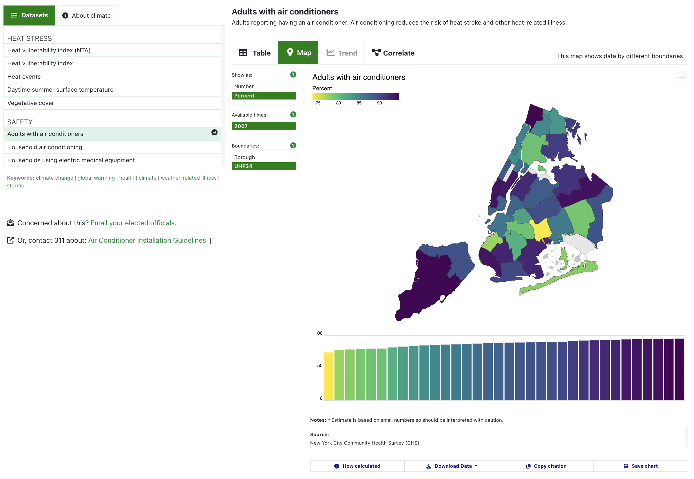
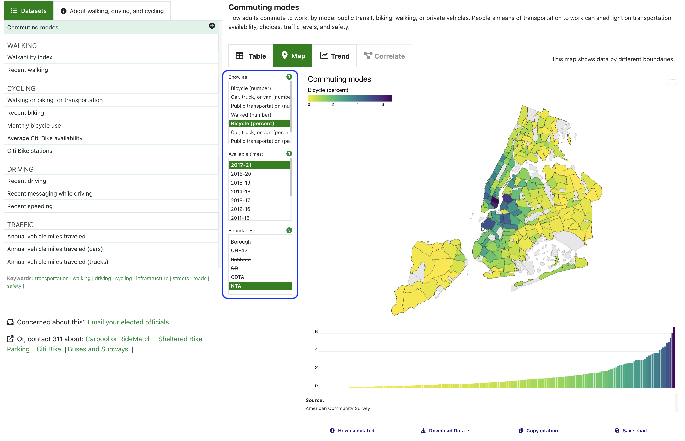
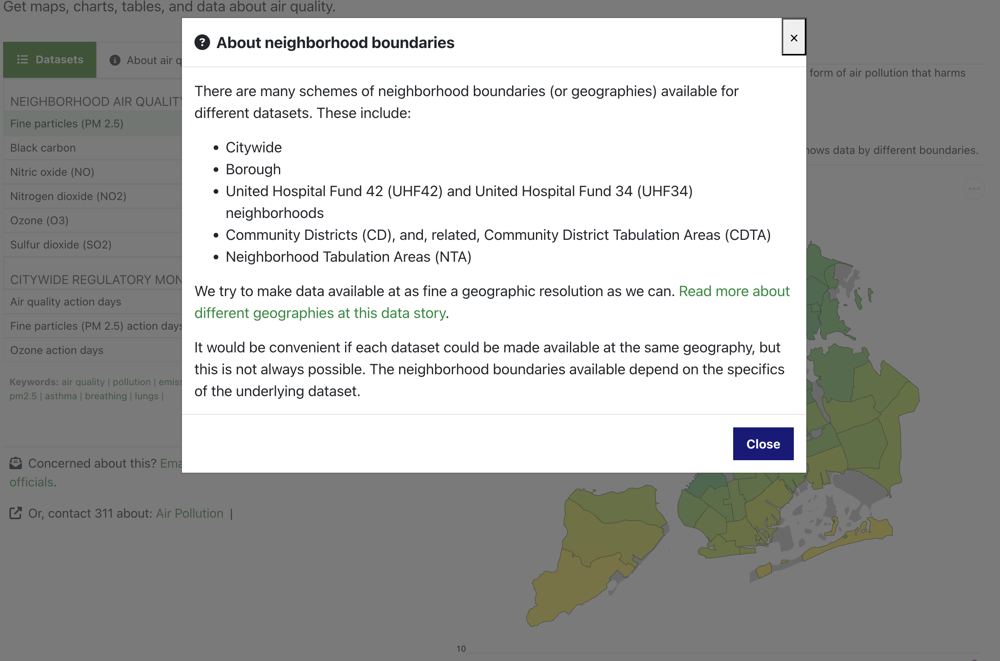
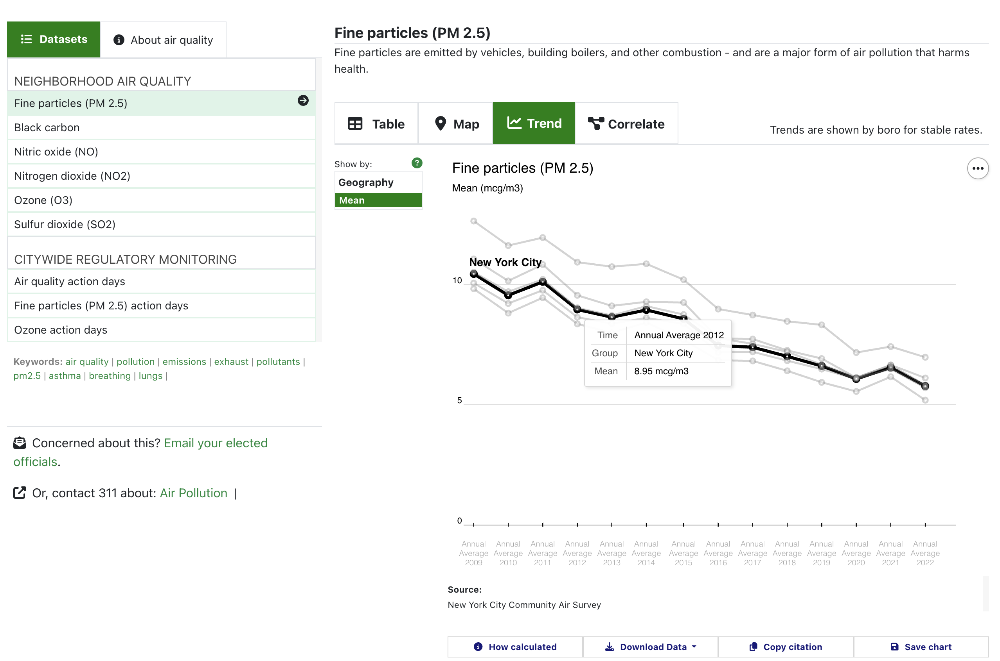
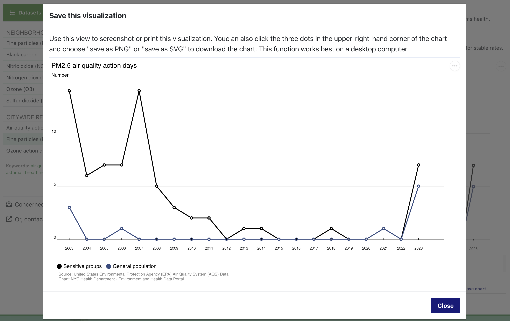
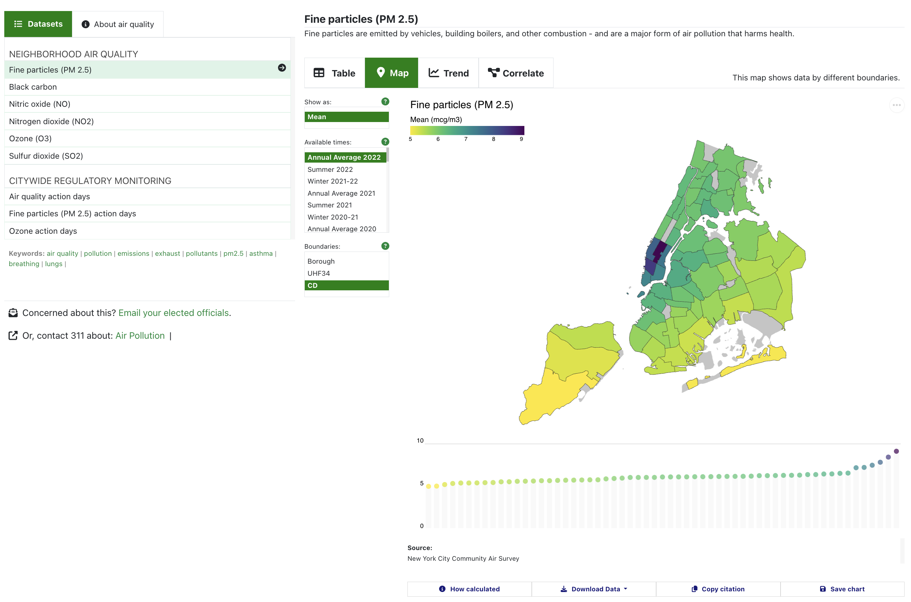

If you browse data on our Data Explorer, you might notice some new changes. In recent months, we've been rolling out a series of modifications and redesigns that, we hope, make it easier for you to browse the data and find what you're looking for.

Here's what the Data Explorer looks like now:

 

Here are some of the changes we've made, and why we've made them.

## Exposing options menus

Each of the Data Explorer's views includes options for how to display the data. Previously, these options were collapsed inside buttons above each chart. But when we tested the website with our users - people like you - we noticed that a lot of people didn't click on the buttons at all. They didn't have labels that were meaningful to our testers - so the testers didn't click the buttons to see what would happen. This was a missed opportunity for people to engage with our data. We thought that by exposing what was in these menus, it would show the available options and let you know other ways you can control what data are displayed.

These options depend on the underlying datasets, so different datasets have different options.

 

## Adding info pop-ups

When we tested the website, we also found that a lot of people were confused by what was or wasn't available, and the language we used to describe datasets. So, we added info pop-ups throughout the data explorer to better explain.

Here's an example: **Geographies**. To us, a "geography" as a set of boundaries - like states, or counties. For NYC, a "geography" is a way of dividing up the city into neighborhoods. There are different ways to cut the city into neighborhoods - and different datasets can be cut up in different ways. For our datasets, you can explore the data by different neighborhood schemes ("geographies").

But a lot of people weren't sure what this label, "Geographies", meant - and they didn't know what the neighborhood abbreviations, like CD, UHF42, and NTA, meant either. So, we changed the label to "Boundaries," and added an info pop-up that explains those abbreviations and links to more information about them.

 

## Creating an option to print or save the chart

We re-designed the trend chart to optimize it for using on any device, whether a desktop computer or mobile phone. In doing this, one choice that we made was to remove the legend in favor of labels that appear when you hover over each line.

 

But one drawback to this choice is that it makes the chart less useful if you want to print or save it to use it in your own report or presentation.

So, we created a **"Save chart"** button that launches a version of the visualization that is optimized for saving or printing. This means that the trend charts include legends, the maps include the year of data, and all charts include the data source and other important notes.

 

## New colors

We updated our visualizations with new color schemes.

For the maps, we use a package called [viridis](https://cran.r-project.org/web/packages/viridis/vignettes/intro-to-viridis.html). This yellow, green, and purple color scheme helps to highlight _both_ high and low values - meaning that it's equally useful for datasets where high values are bad, and datasets where low values are bad. For the trend charts and scatterplots, we used colors derived from another color scale in the viridis package, "magma." These colors look like the belong together, but they also are sufficiently distinct as to be functional for categorical data. And, these two color scales also work well for people with various forms of colorblindness.
 

## A small change to how we show means

For datasets where the values are **means**, we've replaced the bar chart that accompanies the map with a dot chart instead.

Bar charts are useful for showing values like counts or rates. But research shows that when a bar chart is used to show a mean (or an average) - a value that is made up of a variety of values, some of which fall inside the bar and some of which fall outside the bar - people tend to underestimate the distribution. That is, they don't expect that the bar represents values that fall above/outside the bar. [You can read more about this bar chart research here](https://www.effaff.com/sketchy-bar-charts/).

Because of this, we've changed the map's bar chart to be a dot plot when it shows means.

 

**Some of these changes may seem small**, but they're all done to try to make things easier and more intuitive for you.

The purpose of this website is to make data easier to access, understand, and use. That's why we test a lot of our work with people who use the website - and we make changes designed to make things easier for you.

<a href="mailto:ehdp@health.nyc.gov">Feel free to email us if you have any questions</a> - we're always happy to talk or to help.
