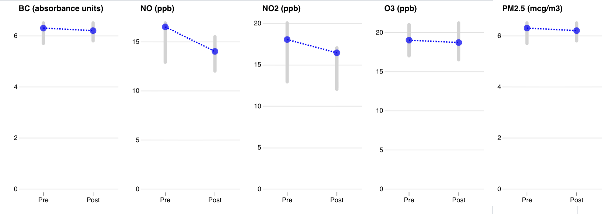

<h3 class="h4">Pollution inside of the CRZ</h3>

Along major roads inside the CRZ, daily average PM2.5 declined by 7%. ​

In the neighborhoods within the CRZ, NO2 and NO went down by X% ​and PM2.5 and BC by X%.

<!--  -->
