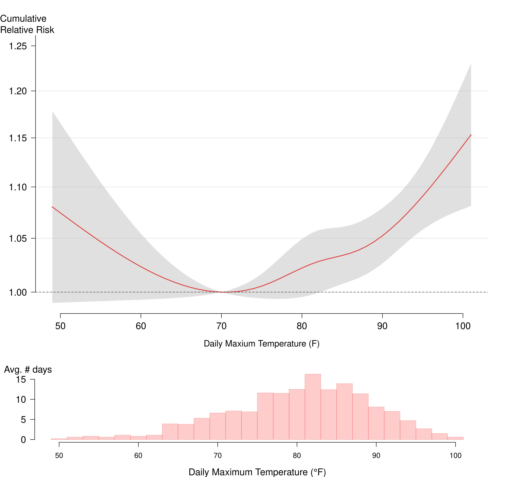

Figure 3: Annual average heat-exacerbated deaths for Extreme Heat Event days, and days at or above 82°F in 5-year moving time windows. The x-axis label denotes the beginning year of 5-year windows (e.g., “2017” for 2017-2021).

<iframe title="Figure 3: Annual average heat-exacerbated deaths for Extreme Heat Event days, and days at or above 82&deg;F in 5-year moving time windows." aria-label="Scatter Plot" id="datawrapper-chart-a899A" src="https://datawrapper.dwcdn.net/a899A/4/" scrolling="no" frameborder="0" style="width: 0; min-width: 100% !important; border: none;" height="618" data-external="1"></iframe>

<strong>Figure 4:</strong> cumulative relative risk and 95% confidence intervals of heat-exacerbated deaths for daily maximum temperature over same-day and 3 previous days, May-September (2012-2021). 
