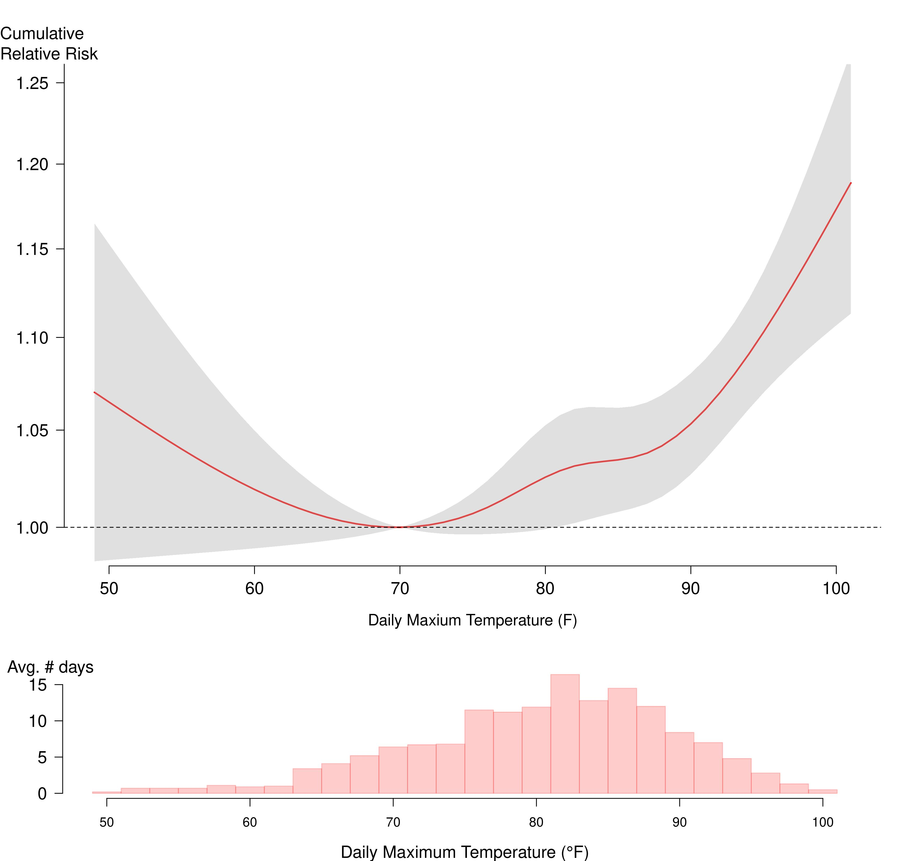

Figure 3: Annual average heat-exacerbated deaths for Extreme Heat Event days, and days at or above 82°F in 10-year moving time windows (e.g., “2023” for 2014-2023).

<noscript></noscript>

<strong>Figure 4:</strong> cumulative relative risk and 95% confidence intervals of heat-exacerbated deaths for daily maximum temperature over same-day and three previous days, May-September (2014-2023). 
