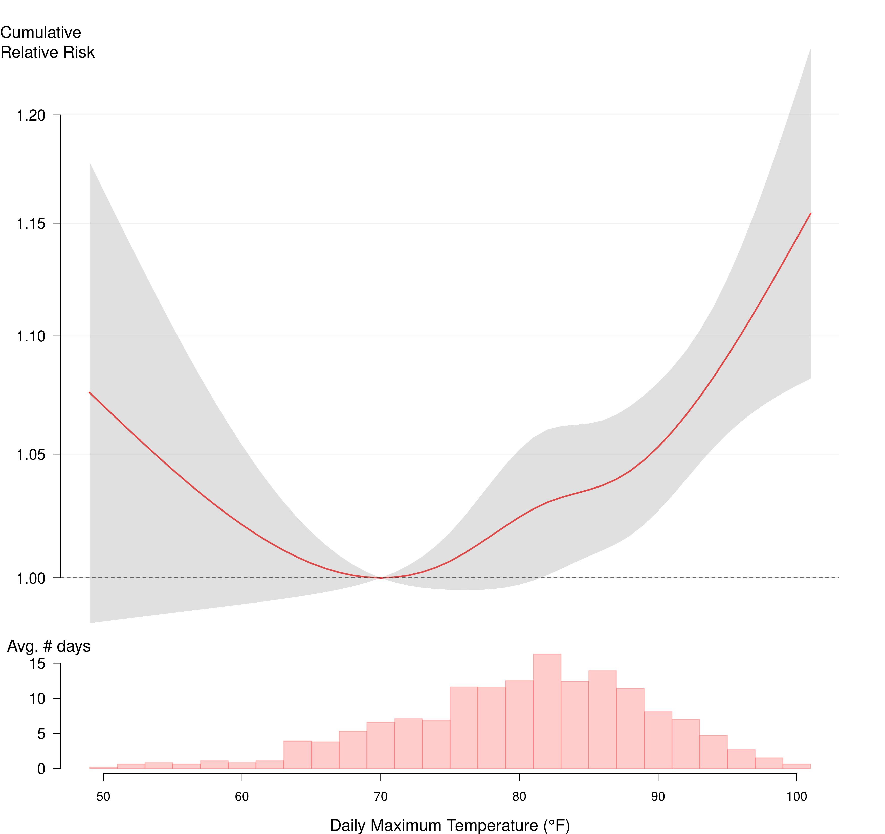

Figure 3: Annual average heat-exacerbated deaths for Extreme Heat Event days, and days at or above 82°F in 5-year moving time windows. The x-axis label denotes the beginning year of 5-year windows (e.g., “2017” for 2017-2021).

<noscript></noscript>

<strong>Figure 4:</strong> cumulative relative risk and 95% confidence intervals of heat-exacerbated deaths for daily maximum temperature over same-day and 3 previous days, May-September (2012-2021). 