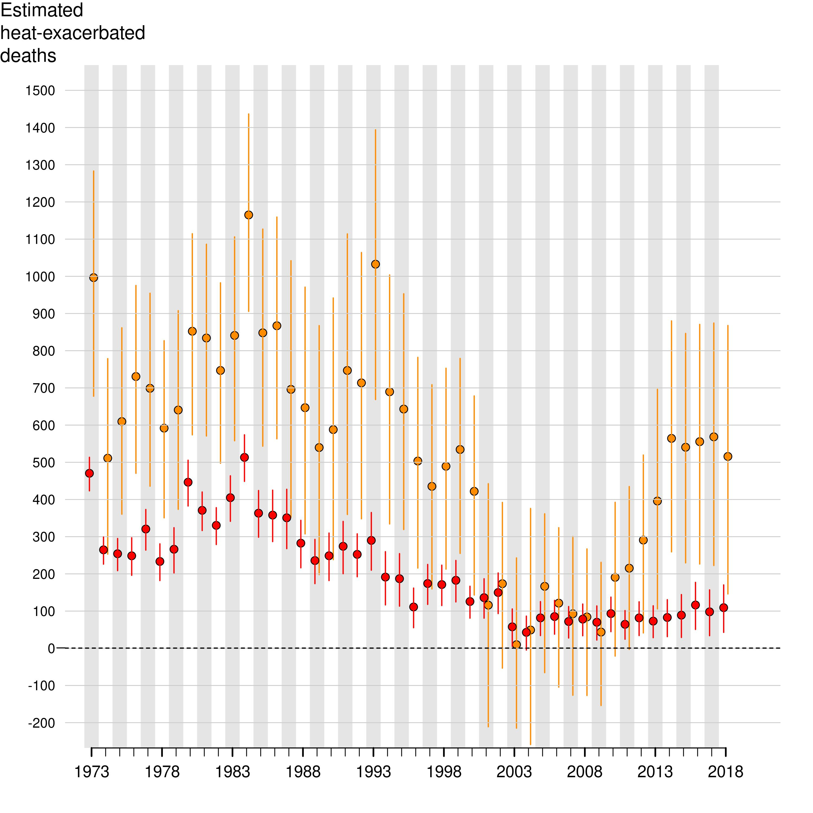

<strong>Figure 5:</strong> Odds ratios (relative to < 74°F range) and 95% confidence bands of at-home deaths as a function of range (quintiles) of daily maximum temperature averaged over the date of death and three previous days.

Insert fig 5 here

<strong>Figure 6:</strong>  Odds ratios (relative to < 74°F range) and 95% confidence bands of at-home deaths by race/ethnicity as a function of range (quintiles) of daily maximum temperature averaged over the date of death and three previous days.

