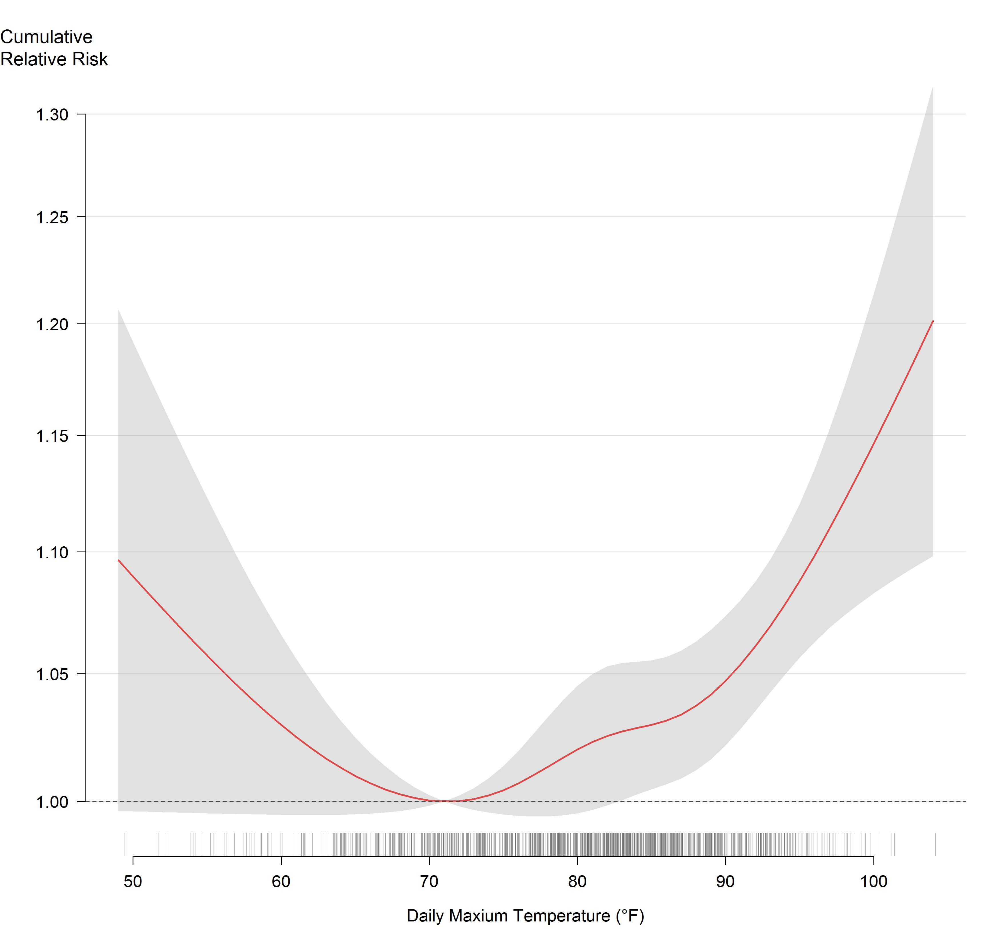
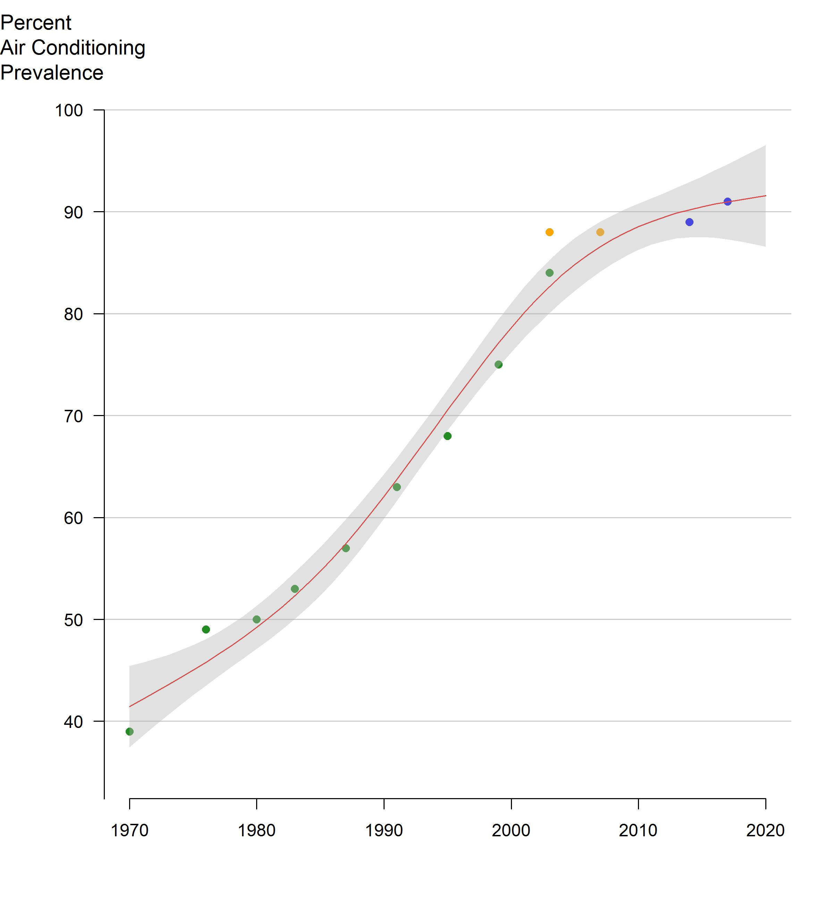

## Summary

* Each summer, on average, **an estimated 350 New Yorkers die prematurely because of hot weather** in New York City (NYC). These heat-related deaths account for about 2% of all deaths over the warm season months of May through September. Of the 350 deaths:
  * From 2012-2021, there were an average of 7 **heat-stress deaths** (caused directly by heat).
  * From 2016-2020, there were an average of about 345 **heat-exacerbated deaths** (caused indirectly by heat aggravating an underlying illness).
* **Heat-exacerbated deaths have been increasing in the past decade**, mainly due to hotter summers overall with more “non-extreme hot days” of 82°F or up to but below the extreme heat threshold. &nbsp;
* **Black New Yorkers are more likely to die from heat stress**, with death rates two times higher than White New Yorkers. This inequity is due to past and current structural racism that creates economic, health care, housing, energy, and other systems that benefit White people and disadvantage people of color. &nbsp;
* **Lack of access to home air conditioning (AC) is an important risk factor for heat-stress death.** Among those who died from heat stress, the place of death was most often an un-air-conditioned home.
* NYC summers are getting hotter because of climate change. **Emergency response to extreme heat must be coupled with equitable investments in structural interventions and heat mitigation measures that reduce risk throughout the season.** For example, New Yorkers will need energy efficient home cooling that they can afford to run, while tree planting and greening can help reduce local temperatures while providing shade.

## Introduction

Hot weather is dangerous to health, sometimes resulting in death. Heat-related deaths are preventable. In this third annual report on heat-related mortality, the NYC Health Department examined data from 2012-2021.

We track heat-related deaths in three ways:

* **Heat-stress deaths** (also called heat stroke deaths) are caused directly by heat and happen when heat-related illnesses, such as heat exhaustion and hyperthermia, lead to death. These deaths are coded as heat-related in death certificates, and cases can be counted and investigated.
* **Heat-exacerbated deaths** happen when heat worsens existing chronic conditions, such as heart disease. These deaths are caused indirectly by heat and are estimated using statistical models. They are also often called “excess” mortality.
* **Neighborhood impacts** are tracked by looking at community-level differences in risk of heat-related death and are described using the NYC Health Department’s Heat Vulnerability Index (HVI). HVI data inputs for income, race, and surface temperature were updated for this analysis. Data for neighborhood air conditioning prevalence and green space remains the same as last year’s report because updated data were not available.

Starting this year, we report estimated heat-exacerbated deaths for the current and past 20 years in five-year rolling time windows to look at trends. For heat-stress deaths (caused directly by heat), we report counts and the annual average for the past ten years. [Previous years' reports are available here.](#previous-reports)​

## Heat Stress Deaths

The NYC Health Department examined heat-stress deaths occurring during the warm season months of May through September from 2012-2021. We reviewed death certificates and medical examiner investigation reports in cases where heat was recognized as a cause of death. A more detailed description of methods and data sources can be found in the <a href="2023/Heat Mortality Methods 2023.pdf" target="blank">Appendix Methods and Supplemental Data</a>

Among NYC residents, there were 68 heat-stress deaths over the 10-year period. There was an average of 7 deaths per year, with the largest yearly numbers of deaths occurring earlier in the period as a result of a severe heat wave in 2013. Most deaths occurred in July (68%), followed by June (13%), August (12%), September (4%), and May (3%). As of January 2023, there were 8 heat-stress deaths in 2022, though that number is provisional and subject to change because mortality records are not finalized.&nbsp;&nbsp;

**Figure 1:** Heat-stress deaths and maximum heat index by year, NYC residents (2012-2021)

<iframe src="2023/Fig_1_interactive.html" scrolling="no" frameborder="0" style="width: 0; min-width: 100% !important; border: none; height:400px;"></iframe>

 <strong>Notes:</strong> The number of heat-stress deaths for 2021 is provisional. If additional deaths are certified as caused by heat stress, the number will be updated in future reports. Weather data are from the National Weather Service LaGuardia airport station. Heat index is a measure of air temperature and humidity.

## Demographics

* Black New Yorkers have an age-adjusted death rate is that is twice as high as that of White New Yorkers (1.3 deaths per million compared with 0.6 deaths per million) from 2012-2021. This inequity is rooted in systemic racism \[1\]. Lack of equitable access to resources needed for wellness – for example, jobs that pay a living wage, affordable and healthy housing with air conditioning, and health care – are causes of these differences in heat-related mortality.&nbsp;
* Death rates were higher in neighborhoods with more residents living below the federal poverty line compared with wealthier neighborhoods.&nbsp;
* Heat-stress deaths occurred among all age groups, with the lowest rates among people aged 20 and younger and the highest among people aged 60 and older. &nbsp;
* About two thirds of heat-stress deaths occurred among men.&nbsp;
* Age-adjusted death rates were highest in Brooklyn.

<strong>Figure 2:</strong> Demographic characteristics of heat-stress decedents (2012-2021)
<iframe title="Demographic characteristics of heat stress decedents, 2012-2012" aria-label="Bar Chart" id="datawrapper-chart-Spd0s" src="https://datawrapper.dwcdn.net/Spd0s/5/" scrolling="no" frameborder="0" style="width: 0; min-width: 100% !important; border: none;" height="765" data-external="1"></iframe>

<strong>Note on race and ethnicity:&nbsp;</strong>Deaths are grouped into five race and ethnicity categories due to the small sample size of deaths and the availability of denominator data. However, these categories represent an oversimplification of the ethnically and racially diverse population found in NYC. People identified as two or more races or races and ethnicities not listed here are included in the other or unknown category. The Hispanic category includes people of any race. Differences in mortality rates among racial and ethnic groups are due to long-term structural racism, not biological or personal traits. Structural racism — centuries of racist policies and discriminatory practices across institutions, including government agencies, and society — prevents communities of color from accessing vital resources (such as health care and healthy housing) and opportunities (such as employment and education), and negatively affects overall health and well-being. See <a href="Heat Mortality Methods 2023.pdf" target="blank">Appendix Methods and Supplemental Data</a> for more information on numbers and percentages by race and ethnicity.

##

## Health Risk Factors

* Among decedents with detailed medical examiner records available, 90% had at least one chronic health condition.
* Common chronic conditions included cardiovascular disease, substance or alcohol use, serious mental health or cognitive conditions, and a history of diabetes.

<strong>Table 1:</strong> Medical characteristics among subset with review of health conditions in medical examiner records (n=59) (2012-2021)
<iframe title="Health conditions table" aria-label="Table" id="datawrapper-chart-zAvcP" src="https://datawrapper.dwcdn.net/zAvcP/1/" scrolling="no" frameborder="0" style="width: 0; min-width: 100% !important; border: none;" height="387" data-external="1"></iframe>

## Heat Exposure Circumstances

People who died from heat stress were most often exposed to dangerous heat in homes (60%, n= 35 of 58 records with detailed information available about onset place). Without AC,&nbsp;[indoor temperatures can be much higher than outdoors](https://journals.ametsoc.org/view/journals/bams/99/12/bams-d-16-0280.1.xml), especially at night, and can continue for days after a heat wave \[2\].&nbsp; Among New Yorkers who were exposed in homes, and for whom there was information about the presence or absence of an AC, none had or were using AC. About a quarter (n=15, 26%) of decedents were exposed outdoors, 7% (n=4) were exposed in parked cars, and 5% (n=3) were exposed indoors at worksites. Overall, 10% (n=6) of deaths were work-related.

<strong>Table 2:</strong> Air conditioning presence among heat stress decedents exposed to heat in homes (2012-2021)
<iframe title="AC status of heat stress deaths at home" aria-label="Table" id="datawrapper-chart-7F4Tg" src="https://datawrapper.dwcdn.net/7F4Tg/1/" scrolling="no" frameborder="0" style="width: 0; min-width: 100% !important; border: none;" height="210" data-external="1"></iframe>

About a third (n=12, 34%) of people who were exposed to dangerous heat at home had an electric fan present and on, indicating that using an electric fan without an AC cannot always prevent death during extreme heat for people who are at highest heat risk.

Previous NYC Health Department studies have found that air conditioning access differs across race and class. Black New Yorkers and low-income New Yorkers are less likely to own or use an AC during hot weather, and the main reason is cost [\[3\]](https://nyccas.cityofnewyork.us/nyccas2022/report/1#References). While more than 90% of NYC households currently have air conditioning, access can be as low as 76% in neighborhoods where more people are living with limited financial resources.

## Heat Exacerbated Deaths

Deaths from chronic conditions that are not recognized as heat-related on death certificates can be estimated using statistical models. There are more of these deaths than those from heat stress. They are called “excess deaths” or “heat-exacerbated deaths.” Unlike heat-stress deaths, which can be individually identified and investigated, excess deaths can be estimated only as aggregate counts. However, estimating heat-exacerbated deaths – or “mortality” – better captures the true extent of how many New Yorkers are dying of the heat.

In the previous two annual reports, we estimated heat-exacerbated mortality risk and number of deaths for a 9-year period (e.g., 2011-2019 for the 2022 report) using weather and natural cause death data for May-September in NYC. Starting this year, we report estimated heat-exacerbated deaths for the current and historical data in five-year rolling time windows to characterize trends. The average natural death count per year was about 18,000 for May through September for the most recent 5-year period (2016-2020). We used time-series statistical models to compare deaths on hot days with those on cooler days. We estimated heat-exacerbated deaths using:

* an indicator (yes/no) for extreme heat event days defined by the National Weather Service’s heat advisory threshold for NYC. Based on the NYC Health Department’s previous analysis of heat-exacerbated mortality, heat advisories are for at least 2 consecutive days with 95°F or higher daily maximum heat index (HI) or any day with a maximum HI of 100°F or higher.
* a range of hot daily maximum temperatures that includes both extreme heat event days and other hot days. We estimated heat-exacerbated deaths for days ranging from the median maximum daily temperature of 82°F through the highest temperature during the period.

These models were run in 5-year rolling time windows between 1971 and 2020. We included deaths occurring on the date of exposure to hot weather and over the following 3 days because previous NYC Health Department studies have shown that heat-exacerbated deaths can occur up to 3 days after the initial hot weather \[4\]. Detailed methods used to estimate risks and attributable deaths can be found in the <a href="Heat Mortality Methods 2023.pdf" target="blank">Appendix Methods and Supplemental Data</a>

To describe the impact of climate change, we examined how the number of hot days during warm months changed over the past five decades (1971-2020) in rolling 5-year time windows. We also computed the average of daily maximum temperature for each month between May and September to examine if changes in temperature varied by month. &nbsp;

* Historically, the estimated impacts of heat, both extreme and non-extreme hot days, declined substantially between 1971 and 2000, plateaued after 2000, and then started increasing in the past decade (see Figure 3).

* From 2016 to 2020, the most recent 5-year time window, the estimated annual average of heat-exacerbated deaths from May-September for all hot days was 345 (95% Confidence Interval \[95CI\]: 139, 549). Heat-exacerbated deaths make up approximately 2% of all natural-cause deaths in the warm months in this most recent period. Heat-exacerbated deaths at and above 82°F show an upward trend in the past decade (see Figure 3).

* The estimated annual average of heat-exacerbated deaths associated with extreme heat events for 2016-2020 was 115 (95% CI: 50, 177). In contrast to the trend for both extreme and non-extreme hot days, heat-exacerbated deaths due to only extreme heat days are relatively constant over the past decade (see Figure 3).

* Heat-exacerbated mortality risks were observed across the full range of hot days (maximum temperature at or above 82°F) during warm season months. Risk increased with temperature, with the largest increases occurring at the highest temperatures, and a steeper slope of relative risk above 90°F (see Figure 4).

* Heat-attributable deaths occurred most frequently in July (37%), followed by August (28%), June (18%), September (10%), and May (7%) for 2016-2020.

<iframe title="2023 Heat Mortality Report Figure 3" aria-label="Scatter Plot" id="datawrapper-chart-qoldt" src="https://datawrapper.dwcdn.net/qoldt/2/" scrolling="no" frameborder="0" style="width: 0; min-width: 100% !important; border: none;" height="702" data-external="1"></iframe>

<strong>Figure 4:</strong> cumulative relative risk and 95% confidence intervals of heat-exacerbated deaths for daily maximum temperature over same-day and 3 previous days, May-September (2011-2020)  
<em>Ticks represent days at each temperature</em>

<u><em>Hotter Summers</em></u>\: There are many more days every summer that are hot but not extremely hot (i.e., daily maximum temperature at or above 82°F to single days of 95°F) compared to extreme heat event days. These days are also associated with increased risk of heat-related death (Figure 4). Due to climate change, the numbers of extreme heat events and non-extreme hot days are increasing, which contributes to an increase in heat-exacerbated deaths.

* The average number of non-extreme hot days increased from 52 in 1971-1975 to 74 days in 2016-2020, whereas the number of extreme heat days only increased from 4 in 1971-1975 to 11 in 2016-2020(See Figure 5). Based on the results presented in Figures 3 and 5, the increasing number of non-extreme hot days in the past decade accounts for the increase in overall heat-exacerbated deaths in the past decade.
* The average daily maximum temperature in July—the month with the highest heat-health risk—increased 5°F, from 83°F in 1971-1975 to 88°F in 2016-2020. The average daily maximum temperature in other months also increased by 3 to 5°F (see Figure 6).

Given the consistently high and increasing proportion of hot days in July and August, heat-risk mitigation planning needs to emphasize non-emergency interventions, such as access to air conditioning. According to US Census Bureau’s [American Housing Survey](https://www.census.gov/programs-surveys/ahs.html) and [Housing and Vacancy Survey](https://www.census.gov/programs-surveys/nychvs.html) conducted in New York City, air conditioning (AC) prevalence increased from about 40% in 1970 to over 80% by mid-2000 (Figure 7), likely explaining the reduction in estimated heat-exacerbated deaths in the corresponding period (Figure 3). However, the rate of increase in AC prevalence appears to have slowed since mid-2000 (Figure 7), as the number of hot days continued to increase, highlighting the urgency of achieving equitable cooling in the very near future.

<strong>Figure 5:</strong> Average number of extreme heat events and non-extreme hot days (daily maximum temperature above 82°F but excluding EHE days) in 5-year time windows (1971-2020)<iframe title="Non-extreme hot days" aria-label="Interactive line chart" id="datawrapper-chart-UxOqX" src="https://datawrapper.dwcdn.net/UxOqX/3/" scrolling="no" frameborder="0" style="width: 0; min-width: 100% !important; border: none;" height="450" data-external="1"></iframe><iframe title="Extreme heat events" aria-label="Interactive line chart" id="datawrapper-chart-VFDRo" src="https://datawrapper.dwcdn.net/VFDRo/3/" scrolling="no" frameborder="0" style="width: 0; min-width: 100% !important; border: none;" height="300" data-external="1"></iframe>
 <strong>Figure 6:</strong> Monthly average daily maximum temperature (°F), measured from LaGuardia Airport (5-year moving windows)<iframe title="Figure 6: Monthly average daily maximum temperature (°F), measured from LaGuardia Airport (5-year moving windows)" aria-label="Interactive line chart" id="datawrapper-chart-zqk7k" src="https://datawrapper.dwcdn.net/zqk7k/2/" scrolling="no" frameborder="0" style="width: 0; min-width: 100% !important; border: none;" height="700" data-external="1"></iframe>

<strong>Figure 7:</strong> Air conditioning (AC) Prevalence estimated from three surveys between 1970 and 2017: American Housing Survey; New York City Community Health Survey; and Housing and Vacancy Survey.   

<em>The line is fitted using natural cubic splines with 3 degrees of freedom. AHS and HVS surveys were weighted to households, whereas CHS data were weighted to individuals in the census</em>

## Community-Level Impacts

The HVI shows differences in community-level heat impacts during and shortly after extreme heat events (5). The HVI combines environmental factors (measures of a neighborhood’s average surface temperature and percentage of green space) with social factors (percentage of homes with air conditioning, residents’ median income, and the percentage of residents who are Black) to develop a relative measure of a neighborhood vulnerability to heat.

Unlike many social vulnerability indices, the HVI is derived from NYC mortality data, which means that neighborhoods with elevated risk identified by the index are those areas with elevated heat-exacerbated deaths during extreme heat events. HVI scores range from 1 (lowest risk) to 5 (highest risk). The relative heat mortality risk of each&nbsp;[Neighborhood Tabulation Area (NTA](https://www1.nyc.gov/site/planning/data-maps/open-data/dwn-nynta.page)) can be explored&nbsp;[here](../hvi).

Including race in the HVI analysis is critical to understanding the impact of heat: structural racism has resulted in neighborhood disinvestment, racist housing policies, fewer job opportunities and lower pay, and limited access to high-quality education and health care, all of which are associated with health risks including those related to heat. Read more about how structural racism affects&nbsp;[housing and public health](../../../data-stories/housing)&nbsp;and the&nbsp;[history of redlining and how it impacts public health in NYC](../../../data-stories/redlining/index.html).

We updated data for three HVI variables for which new data were available — race, income, and surface temperature — and conducted an analysis to re-examine associations between the updated HVI and heat-exacerbated mortality (see&nbsp;<a href="Heat Mortality Methods 2023.pdf" target="blank">Appendix Methods and Supplemental Data</a>&nbsp;for more information).

The updated HVI continues to be associated with heat-exacerbated mortality during extreme heat and on non-extreme hot days. The odds of dying during hot weather was higher in census tracts with higher HVI scores (see Figure 8). Among the HVI components, air conditioning, race, and income had the strongest associations with heat-exacerbated mortality (see <a href="Heat Mortality Methods 2023.pdf" target="blank">Appendix Methods and Supplemental Data</a>) While green space had a weak protective association compared to the other factors in the HVI, it is a critical factor in addressing the [Urban Heat Island](https://www.epa.gov/green-infrastructure/reduce-urban-heat-island-effect) effect by lowering surface and outdoor air temperatures, providing relief from the heat through shade, and supporting a range of public health benefits beyond heat-related mortality.

<strong>Figure 8:</strong> Relative odds and 95% confidence intervals of dying on days reaching 82°F and higher, by quintile of HVI.<iframe title="Figure 8: Relative odds and 95% confidence intervals of dying on days reaching 82°F and higher, by quintile of HVI" aria-label="Scatter Plot" id="datawrapper-chart-FOJlT" src="https://datawrapper.dwcdn.net/FOJlT/2/" scrolling="no" frameborder="0" style="width: 0; min-width: 100% !important; border: none;" height="557" data-external="1"></iframe>

The best indicator of&nbsp;[neighborhood-level heat impacts is the HVI](../hvi) (see map 1), which shows differences in heat-exacerbated mortality risk. The number of heat stress deaths by NTA (map 2) should be interpreted with caution. The NTAs are small and the number of deaths at this level is also small and unreliable, so it is difficult to tell whether differences between areas are due to random fluctuation or because there is a difference in risk.

<iframe title="Heat vulnerability index" aria-label="Map" id="datawrapper-chart-P5pGy" src="https://datawrapper.dwcdn.net/P5pGy/1/" scrolling="no" frameborder="0" style="width: 0; min-width: 100% !important; border: none;" height="727" data-external="1"></iframe>

<iframe title="Count of heat stress deaths" aria-label="Map" id="datawrapper-chart-JmIkL" src="https://datawrapper.dwcdn.net/JmIkL/1/" scrolling="no" frameborder="0" style="width: 0; min-width: 100% !important; border: none;" height="727" data-external="1"></iframe>

## Conclusion

Heat contributes to the deaths of about 350 New Yorkers, on average, each year during the warm season of May through September. July accounts for the greatest share of heat-exacerbated deaths, and the average daily maximum temperature in July has increased by about 5°F in the past five decades. Deaths have been increasing over the past decade, likely due to both increasing temperatures and lagging access to home AC, particularly in communities most burdened by heat-health impacts.

To prepare for a hotter future and prevent heat-related deaths, the City needs long-lasting, structural interventions alongside emergency preparedness and response. Adapting to a hotter climate means the City must:

* Ensure equitable access to life-saving residential cooling for all New Yorkers.
  * Implement maximum temperature regulations during the summer months for tenants as laid out in 2023 [PlaNYC: Getting Sustainability Done](https://climate.cityofnewyork.us/initiatives/planyc-getting-sustainability-done/).
  * Explore mandates on property owners to provide tenants with AC without additional surcharges.
  * Help eligible residents apply for a free air conditioner with installation through the Home Energy Assistance Program (HEAP)’s [Cooling Assistance Component](https://otda.ny.gov/programs/heap/#cooling-assistance).
* Make summertime utility costs affordable for low- and middle-income New Yorkers so they can use AC to protect themselves from the heat.
  * Expand HEAP Cooling Assistance Component benefits to include summer utility costs.&nbsp;
  * Prohibit electricity disconnections during hot weather, even if bills are unpaid.
  * Make energy prices affordable for all New Yorkers through affordable energy rates for low- and middle-income customers.&nbsp;
  * Fund energy efficient home improvements to help reduce family energy costs and decrease pressure on the electrical grid.
  * Protect the electrical grid, including by discouraging excess cooling in offices and commercial establishments.
* Invest in hyper-local resiliency to make all NYC neighborhoods cooler and safer.
  * Implementing green infrastructure projects, especially in high HVI neighborhoods, including planting trees and other greenery and expanding cool roofs.&nbsp;
  * Support community-based organizations (CBO) working to reduce the health impacts of climate change.
  * Include CBOs and residents in decision-making about and investments in community infrastructure and public space.
  * Fund and provide technical assistance for programs — such as the NYC Health Department’s Be a Buddy — that support CBOs to build community resilience through social cohesion and access to physical and mental health resources that can help people stay safe in the heat.&nbsp;
  * Continue to strengthen emergency response during extreme heat, such as opening cooling centers and issuing heat-health warnings, prioritizing people and communities with the greatest need.

More data and information about heat, climate, and health is available on the NYC Health Department’s&nbsp;[Climate and Health page.](..) Learn more about what the City is doing to mitigate the effects of heat as part of [PlaNYC: Getting Sustainability Done](https://climate.cityofnewyork.us/initiatives/planyc-getting-sustainability-done/).&nbsp;

<strong>Note on years of data included:</strong> For heat-stress, data for 2021 and 2022 are considered preliminary because death data are still being compiled by the Bureau of Vital Statistics. These numbers may be updated in future reports as final data become available; 2021 heat-stress numbers are less likely to change. All heat-stress tables are based on heat-stress deaths from 2012-2021. The heat-exacerbated mortality analysis requires complete daily death counts to produce accurate estimates, making 2020 the most recent available year of data.

 

<strong>References</strong><ol><li>Bailey ZD, Krieger N, Agénor M, Graves J, Linos N, Bassett MT. Structural racism and health inequities in the USA: evidence and interventions. Lancet. 2017 Apr 8;389(10077):1453-1463. doi: 10.1016/S0140-6736(17)30569-X.</li><li>Vant-Hull, B., Ramamurthy, P., Havlik, B., Jusino, C., Corbin-Mark, C., Schuerman, M., Keefe, J., Drapkin, J. K., &amp; Glenn, A. A. (2018). The Harlem Heat Project: A Unique Media–Community Collaboration to Study Indoor Heat Waves, Bulletin of the American Meteorological Society, 99(12), 2491-2506. Retrieved Jan 30, 2023, from&nbsp;<a href="https://journals.ametsoc.org/view/journals/bams/99/12/bams-d-16-0280.1.xml">https://journals.ametsoc.org/view/journals/bams/99/12/bams-d-16-0280.1.xm</a>l</li><li>Madrigano J, Lane K, Petrovic N, Ahmed M, Blum M, Matte T. Awareness, Risk Perception, and Protective Behaviors for Extreme Heat and Climate Change in New York City. Int J Environ Res Public Health. 2018 Jul 7;15(7):1433. doi: 10.3390/ijerph15071433.<a href="https://www.ncbi.nlm.nih.gov/pmc/articles/PMC6069135/">https://www.ncbi.nlm.nih.gov/pmc/articles/PMC6069135/</a></li><li>Metzger KB, Ito K, Matte TD. Summer heat and mortality in New York City: how hot is too hot? Environ Health Perspect. 2010 Jan;118(1):80-6. doi: 10.1289/ehp.0900906. PMID: 20056571; PMCID: PMC2831972. <a href="https://ehp.niehs.nih.gov/doi/10.1289/ehp.0900906">https://ehp.niehs.nih.gov/doi/10.1289/ehp.0900906</a></li><li>Madrigano J, Ito K, Johnson S, Kinney PL, Matte T. A Case-Only Study of Vulnerability to Heat Wave-Related Mortality in New York City (2000-2011). Environ Health Perspect. 2015 Jul;123(7):672-8. doi: 10.1289/ehp.1408178. Epub 2015 Mar 17. <a href="https://www.ncbi.nlm.nih.gov/pmc/articles/PMC4492264/">https://www.ncbi.nlm.nih.gov/pmc/articles/PMC4492264/</a></li></ol>

## Previous reports

* [2022 Heat Mortality Report](../heat-report-archive/2022/)
* [2021 Heat Mortality Report](../heat-report-archive/2021/)