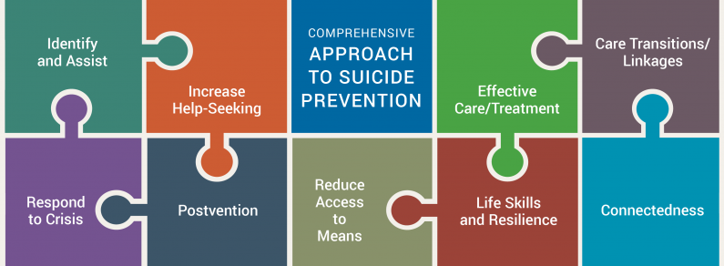

## How homicide and suicide contribute to deaths among young and middle-aged New Yorkers.
 
Young and middle-aged adults don’t typically die from the natural causes that kill older adults. Injuries, both intentional and unintentional, dominate as the cause of death ([See glossary below](#glossary)). When compared with other age groups, homicide and suicide rank higher as causes of death in New York City from age 15 to 44.  Deaths at these ages from these causes are tragic, unnecessary and preventable.  

<em><i class="fas fa-hands-helping text-center mr-1"></i>New Yorkers seeking support with their mental health can connect to trained counselors, for free and in over 200 languages, through NYC Well. For 24/7 support, call 888-NYC-WELL, text “WELL” to 65173 or chat online at <a href="nyc.gov/nycwell">nyc.gov/nycwell</a>. If you or someone you know is at immediate risk of hurting themselves, or in immediate danger, call 911.</em>

<iframe title="Preventable injuries
like Homicide and Suicide are top causes of death in NYC - especially age 15 to 44" aria-label="Scatter Plot" id="datawrapper-chart-7m9V4" src="https://datawrapper.dwcdn.net/7m9V4/1/" scrolling="no" frameborder="0" style="width: 0; min-width: 100% !important; border: none;" height="720" data-external="1"></iframe>

For each subgroup within young and middle-aged New Yorkers — ages 15 to 24, 25 to 34, and 35 to 44 — the homicide and suicide patterns look slightly different. Let’s take a close look at each age group. 

#### Age 15 to 24: homicides and suicides are the second and third leading causes of death.

From age 15 to 24, Black New Yorkers die by homicide at a higher rate than people of other racial and ethnic groups. White and Asian people this age have a homicide rate of close to zero. 

Racial disparities signal historical and structural origins that have and continue to deny resources to people of color. 

<iframe title="Homicide death rate, by race/ethnicity" class="my-4" aria-label="Split Bars" id="datawrapper-chart-XMN9V" src="https://datawrapper.dwcdn.net/XMN9V/1/" scrolling="no" frameborder="0" style="width: 0; min-width: 100% !important; border: none;" height="191" data-external="1"></iframe>

Within this age group, we also see disparities in homicide rates across boroughs. The Bronx has the highest homicide rate of any borough, followed by Brooklyn. The Bronx’s homicide rate for people age 15 to 24 is more than double that of Manhattan, Queens, or Staten Island. 

<iframe title="Homicide rates by borough" class="my-4" aria-label="Split Bars" id="datawrapper-chart-c0bab" src="https://datawrapper.dwcdn.net/c0bab/2/" scrolling="no" frameborder="0" style="width: 0; min-width: 100% !important; border: none;" height="222" data-external="1"></iframe>

Borough differences in homicides likely reflect a history of disinvestment in New York City that varies by neighborhood. Distribution of homicide by place offers a window into the broader physical, social, and economic context – namely, housing and park quality and availability, and access to schools, jobs, opportunities, healthcare, and more.  

Suicide rates among New Yorkers age 15 to 24 are similar across race/ethnicity and across boroughs, with the exception of Staten Island, which has a suicide rate less than half that of other boroughs. 

Both homicide and suicide among people age 15 to 24 are much more common among young men than young women. Teens and men in this age group have homicide rates that are six times the rate of their female counterparts and suicide rates that are three times the rate of their female counterparts. 

#### Age 24 to 34: More suicides than any other age group.  

From 2017 to 2019, there were over 110 suicides each year among these young adults. This is one out of every five suicides across all ages, and two out of five of suicides among 15 to 44 year olds. 

Staten Island has a low rate of suicide among people age 15 to 24, but its suicide rate for people age 25 to 34 is higher than any other borough. 

<iframe title="Suicide rates age 25-34 (Copy)" class="my-4" aria-label="Split Bars" id="datawrapper-chart-dj1Ut" src="https://datawrapper.dwcdn.net/dj1Ut/3/" scrolling="no" frameborder="0" style="width: 0; min-width: 100% !important; border: none;" height="222" data-external="1"></iframe>

Within this age group, the suicide rate is highest among Black non-Hispanic New Yorkers, though not dramatically so. Latinos in this age group have the lowest suicide rate across racial/ethnic groups. 

Homicides are the third leading cause of death in this age group. Racial/ethnic, geographic, and sex disparities in homicide rates look similar in adults ages 25 to 34 as they do in those ages 15 to 24. 

<iframe title="Suicide rates age 25-34" class="my-4" aria-label="Split Bars" id="datawrapper-chart-7rrVq" src="https://datawrapper.dwcdn.net/7rrVq/2/" scrolling="no" frameborder="0" style="width: 0; min-width: 100% !important; border: none;" height="191" data-external="1"></iframe>

#### Age 35 to 44: Unintentional injuries and natural causes are leading causes of death, but suicide ranks fifth.   

White New Yorkers in this age group had a suicide death rate roughly twice that of other race/ethnicity groups in this age group. 

<iframe title="Details: Injury death rates, age 35 to 44   (Copy)" class="my-4" aria-label="Split Bars" id="datawrapper-chart-M7spx" src="https://datawrapper.dwcdn.net/M7spx/1/" scrolling="no" frameborder="0" style="width: 0; min-width: 100% !important; border: none;" height="387" data-external="1"></iframe>

In this age group, the suicide rate among men is more than double the rate among women. In addition, Staten Island continues to rank highest of all boroughs for suicide deaths, followed by Queens. 

Homicides are less prevalent within this age group.  

**By understanding what mechanisms (or weapons) people use for homicides and suicides, we can take steps to prevent these deaths.**

In NYC, most homicide deaths among young and middle-aged adults occur with guns. [Nationwide, guns account for about 8 out of every 10 homicide deaths](https://www.pewresearch.org/short-reads/2023/04/26/what-the-data-says-about-gun-deaths-in-the-u-s/). Stabbing was the second most common mechanism of homicide deaths in NYC. 

Hanging is the leading mechanism of suicides among young and middle-aged New Yorkers, whereas guns are the leading mechanism of suicides nationwide. Guns are responsible for relatively few suicides among adults age 15 to 44 in NYC. 

Suicide and homicide don't just affect the immediate victims. The impacts radiate, potentially widening disparities and additionally causing stress, trauma, and other negative health effects for victims’ friends, neighbors, colleagues and family members. [In communities where New Yorkers are more likely to experience either homicide or suicide, violence is both a personal and public health concern](/data-stories/violence). 

<em><a href="https://sprc.org/effective-prevention/comprehensive-approach">From the Suicide Prevention Resource Center</a></em>.

Means reduction is a key part of a comprehensive suicide prevention strategy. Many people who attempt suicide do so during a short-term crisis, and therefore spend relatively little time thinking about the attempt before taking action ([according to one study of suicide attempt survivors, nearly half spent less than 10 minutes](https://www.hsph.harvard.edu/means-matter/means-matter/duration/)). For these people especially, access to means of self-harm can be the difference between thinking about suicide and actually going through with it.  

The means reduction approach can be applied to homicides, too. [Data shows that where there are more guns, there is more homicide](https://www.hsph.harvard.edu/hicrc/firearms-research/guns-and-death/). So if there are fewer guns, we can expect to see fewer homicide deaths.  

Each of these deaths is a tragedy—but by limiting access to the leading mechanisms of homicide and suicide, NYC has opportunities to prevent deaths among young and middle-aged adults. 

Explore more data here:

<iframe title="Preventable injuries like Homicide and Suicide are top causes of death in NYC - especially age 15 to 44" aria-label="Scatter Plot" id="datawrapper-chart-blYxp" src="https://datawrapper.dwcdn.net/blYxp/3/" scrolling="no" frameborder="0" style="width: 0; min-width: 100% !important; border: none;" height="720" data-external="1"></iframe>

<table class="table table-striped" id="glossary">
  <thead>
    <tr class="table-dark">
      <th scope="col">Term</th>
      <th scope="col">Definition</th>
    </tr>
  </thead>
  <tbody>
    <tr>
      <th scope="row">Unintentional</th>
      <td>Injury death that occurred without intent to cause harm, also known as “accident.”</td>
    </tr>
    <tr>
      <th scope="row">Intentional</th>
      <td>Injury death that occurred with the intent to cause harm. Intentional deaths are further classified as homicides or suicides.</td>
    </tr>
    <tr>
      <th scope="row">Homicide</th>
      <td colspan="2">Intentional death resulting from injuries inflicted by another person.</td>
    </tr>
    <tr>
      <th scope="row">Suicide</th>
      <td colspan="2">ntentional injury death resulting from self-harm. </td>
    </tr>
    <tr>
      <th scope="row">Undetermined</th>
      <td colspan="2">Injury death for which the intent cannot be determined.</td>
    </tr>
  </tbody>
</table>

<em><i class="fas fa-hands-helping text-center mr-1"></i>New Yorkers seeking support with their mental health can connect to trained counselors, for free and in over 200 languages, through NYC Well. For 24/7 support, call 888-NYC-WELL, text “WELL” to 65173 or chat online at <a href="nyc.gov/nycwell">nyc.gov/nycwell</a>. If you or someone you know is at immediate risk of hurting themselves, or in immediate danger, call 911.</em>
