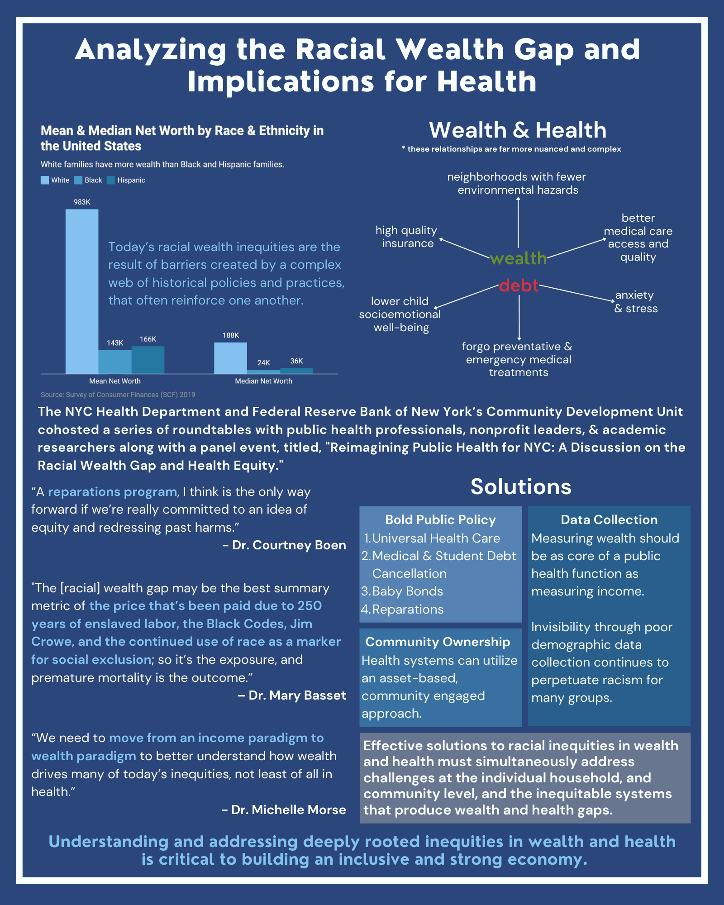

Throughout history, the distribution of wealth in the U.S. has, and continues to be, largely unequal between racial groups. This concept is referred to as the <strong>racial wealth gap</strong> and it has its roots in settler colonialism and enslavement. There is an especially big wealth disparity between White families and Black families, which was established and upheld by racist historical policies and practices. The racial wealth gap has major implications for public health. This is because a large and growing body of research reveals that having good health is connected to having wealth. Effective solutions to racial inequities in wealth and health must address challenges at the individual, household, community, and systems levels.

### White families hold nearly eight times the wealth of the average Black family

Income and wealth are two different concepts. Income is measured by earnings, while wealth is the difference between the value of assets owned and the amount owed in debts. Since wealth incorporates the value of assets accumulated over time, and can be passed down over generations, it provides a more comprehensive representation of one’s economic resources.
Income and wealth are two different concepts. Income is measured by earnings, while wealth is the difference between the value of assets owned and the amount owed in debts. Since wealth incorporates the value of assets accumulated over time, and can be passed down over generations, it provides a more comprehensive representation of one’s economic resources.

The Federal Reserve Board’s 2019 Survey of Consumer Finances (SCF) shows that, nationally, the average White family holds nearly eight times the wealth of the average Black family and over five times the wealth of the average Hispanic family.

<iframe title="Mean and median net worth for  White, Black, and  Hispanic people in the US" aria-label="Grouped Column Chart" id="datawrapper-chart-nqi4y" src="https://datawrapper.dwcdn.net/nqi4y/7/" scrolling="no" frameborder="0" style="width: 0; min-width: 100% !important; border: none;" height="481" data-external="1"></iframe>

### Racist and discriminatory policies have prevented Black families from accruing assets, financial security, and wealth

For much of American history, there has been a record of racist systematic policies implemented by the federal government that helped build wealth for White households while suppressing wealth accumulation for other groups, including Black and Hispanic households.

The Black-White wealth disparity, in particular, has been created and reinforced by systematic policies and practices including racial segregation laws, <a href="../redlining/" target="_blank">redlining,</a> the discriminatory implementation of the New Deal and the G.I. Bill, and more. The inter-generational impacts of the enslavement of Black people have broad impacts on the wealth and health inequities observed today.

### Greater wealth translates to better health

While net worth is found to be a protective factor against poor health, assets such as savings, stock ownership, or homeownership, are found to consistently improve health, and debts such as student loans, credit card debt, or medical debt are associated with worse health, even after adjusting for total net worth.

White households are more likely than Black and Hispanic households to hold all asset types. Ultimately, the median White household has assets more than four times the value of those held by the median Black household, underscoring that the racial wealth gap is primarily driven by differences in asset holdings.

**Explore how wealth translates to health:**

  

    <a class="card-header collapse collapsed font-weight-bold" id="acc-button-01" data-toggle="collapse" href="#panel-acc-button-01"  role="tab" aria-expanded="false" aria-controls="panel-acc-button-01">
      Wealth allows families to access better medical care…
    </a>

  

    

    

    Wealth is strongly correlated with individual and population health in more ways than one. Wealth allows families to afford better medical care, higher quality insurance, and goods and services that promote physical and mental wellbeing. Liquid assets, like savings and stocks, allow households to more readily pay for basic needs, preventative and routine medical care, and weather financial shocks.
    

    

  

  <!-- .collapse -->
  

  <!-- .card (end of first accordion, repeat as needed) -->

  

      <a class="card-header collapse collapsed font-weight-bold" id="acc-button-02" data-toggle="collapse" href="#panel-acc-button-02"  role="tab" aria-expanded="false" aria-controls="panel-acc-button-02">
        …and to live in health-promoting neighborhoods.
      </a>

    

Greater wealth allows people to live in neighborhoods with fewer environmental hazards and more resources, like healthier housing.
                

            

<!-- .collapse -->

  

      <a class="card-header font-weight-bold collapse collapsed" id="acc-button-03" data-toggle="collapse" href="#panel-acc-button-03"  role="tab" aria-expanded="false" aria-controls="panel-acc-button-03">
        Wealth can reduce stress from financial challenges.
      </a>

    

   Wealth can protect families from the negative consequences of financial hardship, including job loss, homelessness or housing insecurity, food insecurity, and the negative psychological effects associated with financial hardship. Intergenerational wealth passed down through inheritance can provide educational and social opportunities that can benefit health in the long run.
                

            

<!-- .collapse -->

  

      <a class="card-header font-weight-bold collapse collapsed" id="acc-button-04" data-toggle="collapse" href="#panel-acc-button-04"  role="tab" aria-expanded="false" aria-controls="panel-acc-button-04">
        Debt and tight budgets lead to reduced spending on medical care and preventative lifestyle habits.
      </a>

    

 Conversely, research shows that when household budgets are constrained, families tend to reduce spending on medical care, groceries, and other health-related goods. Households with limited liquid assets may be less able to afford health-promoting opportunities (for example, quality medical care, physical activity, etc.) and more likely to forgo preventative or emergency medical treatments. Financial hardship is consistently correlated with poorer self-rated health, more chronic diseases, and depressive symptoms in children and adults.
                

            

<!-- .collapse -->

  

      <a class="card-header font-weight-bold collapse collapsed" id="acc-button-05" data-toggle="collapse" href="#panel-acc-button-05"  role="tab" aria-expanded="false" aria-controls="panel-acc-button-05">
        Debt and lower incomes impact socioemotional well-being in negative ways.
      </a>

    

  Debt type plays an important role in health and well-being in both positive and negative ways. For instance, higher levels of home and student loan debt are associated with greater socioemotional well-being for children, whereas higher levels of and increases in unsecured debt (for example, credit card debt) are associated with lower levels of and declines in child socioemotional well-being, respectively.

At the household level, high debts or low assets can increase anxiety, frustration, and hopelessness, and can also lead to health deterioration due to stress. When looking at young adults with student debt, those with high levels of debt stress reported feeling more tense and anxious, troubled by physical problems, and had greater difficulty getting to sleep than students with low levels of debt stress.

<!-- .collapse -->

### Black-White racial health inequities haven't improved

Data shows that Black-White racial health inequities have not narrowed over time. For example, Black-White ratios of mortality from coronary heart disease, cancer, diabetes, cirrhosis of the liver, and infant mortality were larger in the late 1990s than in 1950.

Between 2019 and 2021, the U.S. experienced a widening of its life expectancy gap during the COVID-19 pandemic with Hispanic and non-Hispanic Black populations experiencing larger declines in life expectancy over the two-year period than non-Hispanic White populations.

<iframe title="Health inequities have not improved over time" aria-label="Interactive line chart" id="datawrapper-chart-AbBga" src="https://datawrapper.dwcdn.net/AbBga/2/" scrolling="no" frameborder="0" style="width: 0; min-width: 100% !important; border: none;" height="400" data-external="1"></iframe>

### Reducing the racial wealth gap

In 2021 and 2022, the Federal Reserve Bank of New York, in partnership with the NYC Health Department, convened experts from the nonprofit, research, policy, and government sectors in a series of roundtable discussions to share their thoughts on the solutions, policies, and tools that should be considered to meaningfully address racial wealth and health gaps in the U.S. These experts noted that bold public policy, better data collection, and increased community ownership are needed.

From the convening, it was noted that policies like universal health care, medical debt cancellation, and increasing community ownership can help improve health and address health-related financial inequities—while policies like reparations can directly address the racial wealth gap.

<strong>Universal health care:</strong> By providing low-cost health care to all Americans, universal health care would help prevent individuals from acquiring medical debt and its subsequent deleterious effects on health and financial security.

<strong>Medical debt cancellation:</strong> Medical debt, or medical costs people are unable to pay upfront or when they received care, unequally impacts racial and ethnic communities. Estimates by the U.S. Census Bureau show that 28 percent of Black households carry medical debt, compared with 17 percent of White households.

<strong>Student debt cancellation:</strong> According to the 2019 SCF, Black Americans hold the most student loan debt — $44,880 on average — compared to other races and ethnicities.

<strong>Baby bonds:</strong> Baby bonds are an innovative policy that provide children with publicly funded investment accounts that can be accessed beginning at the age of 18 for specific uses including education, homeownership, small business, and retirement. Any baby bonds proposal should allocate the most resources to Black, Hispanic, and indigenous children.

<strong>Reparations:</strong> A reparations program, such as federally paid cash to Black descendants of enslaved people, would eliminate the Black-White wealth gap, if the payment amounts were predicated on the average difference in Black and White wealth.

Effective solutions to racial inequities in wealth and health must simultaneously address challenges at the individual household and community levels, and the inequitable systems that produce wealth and health gaps.

### Resources

  

    <a class="p-2 card-content primary font-weight-bold resource-card" href="racial-wealth-gap-health-equity.pdf" target="_blank">
      <i class="fas fa-2xl fa-file-pdf mr-1 mb-1"></i>
      
Analyzing the Racial Wealth Gap and Implications for Health Equity (full report).

    </a>
  

  

    <a class="p-2 card-content primary font-weight-bold resource-card"  href="https://www.youtube.com/watch?v=yDgGR-r2xdc" target="_blank">
      <i class="fas fa-2xl fa-play-circle mr-1 mb-1"></i>
      
Reimagining Public Health: A Discussion on the Racial Wealth Gap and Health Equity

    </a>
  

  

    <button type="button" class="p-2 card-content primary resource-card font-weight-bold" data-toggle="modal" data-target="#glossaryModal"><i class="fas fa-book-open mr-1 fa-2xl mb-1"></i>Glossary</button>
  

  

    

      
      <em class="fs-sm"><a href="rwg_visual_abstract.png" target="_blank">Full-size visual abstract for this report</a>.</em>
    

  

<!-- Modal -->

  

    

      

        <h5 class="modal-title" id="glossaryModalLabel" data-pagefind-ignore="all">Glossary</h5>
        <button type="button" class="close" data-dismiss="modal" aria-label="Close">
          &times;
        </button>
      

      

        <table class="table table-striped" id="glossary">
  <thead>
    <tr class="table-dark">
      <th scope="col">Term</th>
      <th scope="col">Definition</th>
    </tr>
  </thead>
  <tbody>
    <tr>
      <th scope="row">Wealth</th>
      <td>Wealth is the difference between the value of assets owned and the amount owed in debts. It is critically tied positive health outcomes.</td>
    </tr>
    <tr>
      <th scope="row">Income</th>
      <td>A flow of resources received on a regular basis, generally from earnings, investments, sale of an item, or transfers</td>
    </tr>
    <tr>
      <th scope="row">Redlining</th>
      <td colspan="2">A discriminatory practice by which firms such as banks and insurance companies refused or limited loans, mortgages, and/or insurance coverage within specific geographic areas with primarily Black, immigrant and low-income residents.</td>
    </tr>
    <tr>
      <th scope="row">Asset</th>
      <td colspan="2">A resource owned with market or economic value. An asset can be a potential source of future income to meet debts, facilitate additional accumulation of resources, or meet other commitments.</td>
    </tr>
    <tr>
      <th scope="row">Debt</th>
      <td colspan="2">Money owed or due to another party.</td>
    </tr>
    <tr>
      <th scope="row">Health equity</th>
      <td colspan="2">Fair and just opportunity for each person to be as healthy as possible, and no one is disadvantaged from achieving this potential due to social position or socially determined circumstances.</td>
    </tr>
    <tr>
      <th scope="row">Racial wealth gap</th>
      <td colspan="2">The difference in net worth between socially identified racial groups.</td>
    </tr>
    <tr>
      <th scope="row">Systemic Racism, or Structural Racism</th>
      <td colspan="2">The totality of ways in which societies foster racial discrimination, via mutually reinforcing inequitable systems (for example, in housing, education, employment, earnings, benefits, credit, media, health care, criminal justice, etc.) that in turn reinforce discriminatory beliefs, values, and distribution of resources, reflected in history, culture, and interconnected institutions.</td>
    </tr>
  </tbody>
</table>
      

      

        <button type="button" class="btn btn-secondary" data-dismiss="modal">Close</button>
      

    

  

