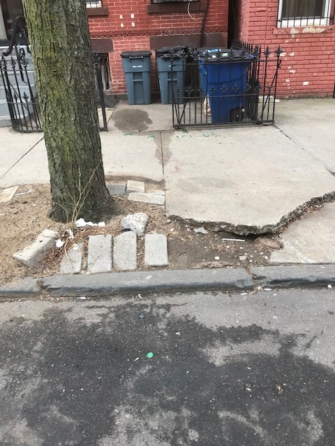
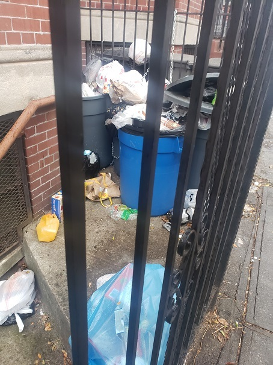

Everyone has a story about rats — or more likely, a complaint. If you have made a complaint using 311, you may wonder who receives it, and how it fits into the bigger picture of rat mitigation.

### What happens to my 311 complaint?

Each year, the Health Department gets about 40,000 complaints about rat activity through 311 (<a href="../../data-features/rat-mitigation-zones/">you can explore these data on NYC Open Data)</a>.

When you submit a complaint via 311, it goes to the NYC Health Department, which is responsible for enforcing the New York City Health Code requirement that building owners keep their properties pest-free. The Health Department checks your complaint against our records. If the property hasn't been inspected recently, the Health Department will send an inspector.

### What happens during an inspection?

When inspectors visit a property, they look for two major things:

- Signs of rats, like burrows, droppings, and gnaw or rub marks
- Conditions that support rats:
  - Unsealed trash cans or loose food garbage they can eat,
  - Build up of old materials that rats can use to create nests, like piles of cardboard boxes or old equipment
  - Cracks or holes they can live in

    

        

          <figure>
            
            <figcaption class="small"><em>Cracks in the sidewalk allow for rats to make burrows and invade properties.</em></figcaption>
          </figure>
        

        

        <figure>
          
            <figcaption class="small"><em>Trash and food waste that isn't in sealed containers creates conditions to attract rats.</em></figcaption>
        </figure>
        

    

If a property has either signs of rat activity or conditions that support rats, it fails the inspection. The Health Department sends the property owner a Commissioner’s Order to Abate (COTA), an inspection report detailing the findings and guidance on how to fix the problem.

If the property is City-owned, the Health Department contacts the agency that manages the property to fix the issues.

    

        

        <figure>
            
            <figcaption class="small"><em>An inspector looks for rat burrows and signs of rats.</em></figcaption>
        </figure>
        

   

A few weeks after the initial inspection, the Health Department conducts a compliance inspection to check whether the property owner has addressed the problem. If the owner hasn’t fixed it, the Health Department will issue a summons subject to fines to the owner.

In some cases, where conditions are especially severe, a Health Department exterminator may treat the property and bill the owner for the work.

  
<noscript></noscript>

<noscript></noscript>

### How to make a rat complaint – the smart way

Not every complaint will trigger an inspection. If a property has recently been inspected, a new complaint won’t trigger another inspection. To find out if a new complaint will help, <a href="../../data-features/rat-information-portal/">visit the Rat Information Portal for up-to-date inspection results</a>. You can look up an address and see when it was last inspected, and if it passed or failed.

<!-- publish link here to other story Read more about how inspection data is the key to understanding rat activity. -->

### Get involved

Want to help work toward a cleaner New York City?

- <a href="https://www.nycservice.org/opportunity/a0TQq00000DwaIoMAJ/nyc-rat-pack">Join the Rat Pack, NYC’s squad of anti-rat community members</a>.
- If you’re a property owner, learn about rat prevention and management.
  - Enroll in a Health Department <a href="https://www.nyc.gov/site/doh/services/rats-control-training.page">Rat Academy class</a> – it’s free!
  - <a href="https://www.nyc.gov/site/doh/health/health-topics/rats.page">Read about the best ways to control rats</a>.
- Learn more about the Health Department’s <a href="https://a816-dohbesp.nyc.gov/IndicatorPublic/data-features/rat-mitigation-zones/">rat control program</a>.

If we work together, we can reduce rats in our communities and prevent them from harming our parks, homes, and make our neighborhoods more livable.
