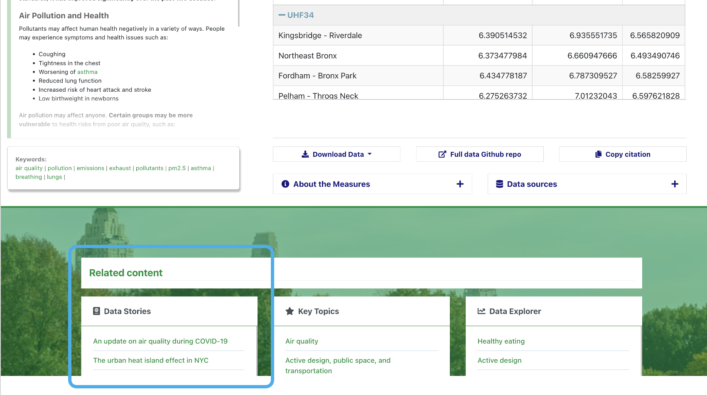
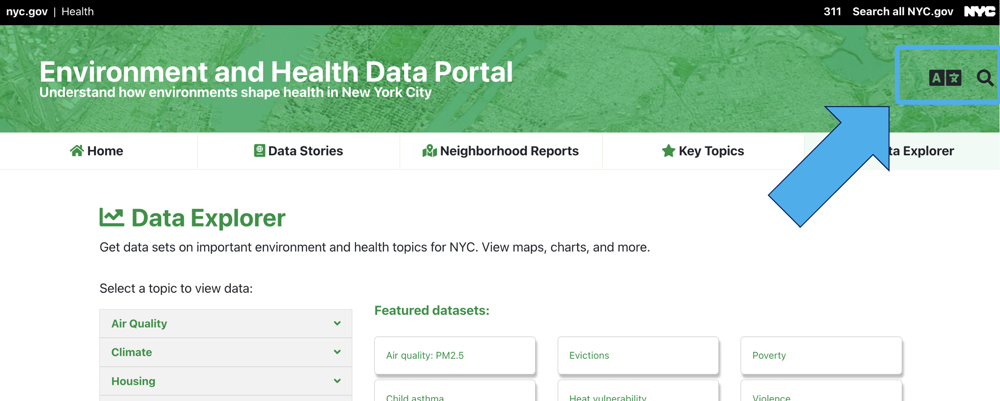

The Environment and Health Data Portal looks a little bit different\! We recently redesigned our site to make it easier for you to find important data and information on how the environment affects health.&nbsp;&nbsp;

Here's what the new site has to offer:&nbsp;

**An updated design:**

The whole site got a fresh design to make exploring easier for you – whether you’re on a desktop computer, a phone, or a tablet. It's been optimized for accessibility, translation, and clear, simple presentation of information, using the [NYC Core Framework](https://www1.nyc.gov/assets/oti/html/nyc-core-framework/index.html), an open-source framework based on Bootstrap.&nbsp;&nbsp;

The navigation bar at the top always tells you where you are and provides quick access to the main sections of the site: Data Stories, Neighborhood Reports, Key Topics, or Data Explorer.&nbsp;&nbsp;

**New ways of connecting information:**

Our site has always aimed to show how environments affect health.&nbsp; Our updates focus not only on improving access to data, but also making it easier to explore connections between different datasets, topics and other site content:&nbsp;

- [Key Topics](key-topics/) bring together in one display related datasets, custom data interactives, data stories, and neighborhood reports for special areas of environmental health. You can explore resources across the site for : [Air Quality](key-topics/airquality/); [Climate](key-topics/climatehealth/); [Housing](key-topics/housing/); [Inequality and Health Inequities](key-topics/social/); [Active Design, Public Space, and Transportation](key-topics/transportation/); [Environmental Health Outcomes](key-topics/healthoutcomes/); [Child Health](key-topics/childhealth/); [Pests and Pesticides](key-topics/pests/); and [Food and Drink](key-topics/foodanddrink/).&nbsp;

* Keywords link you to other pages on the similar topics.&nbsp;

- Throughout the site, you'll see links to related content. For example: when you're browsing datasets about Air Quality, you'll be able to quickly jump directly to related Data Stories. &nbsp;

- And if you can't find what you're looking for, our re-vamped search function can help you find it.&nbsp;&nbsp;

**Greater usability**&nbsp;

Our goal is for you to be able to put our data and information to work improving health throughout our city. And when we do user research, one of the most common things we hear is, "It has to be easy to use." So, we've built the site with this as our mantra.&nbsp;

For example, take a look at our re-vamped [Data Explorer](data-explorer/). &nbsp;

On the page:&nbsp;

- We designed the visualization pages to be fast and smooth, making it easier to click around and explore.&nbsp;
- &nbsp;About The Topic text added to the visualization page pairs information and context with the data.&nbsp;

Making choices:&nbsp;

- When you're exploring a dataset (or indicator), you can quickly&nbsp; load related indicators for the same topic.&nbsp;
- Our re-designed data option menus make it easy to change the geography, year, or measure when you're looking at the data.&nbsp;
- With a click of "Change topic", you can swiftly select a whole new area to explore.&nbsp;

New ways to view data:&nbsp;

We aim to highlight important stories in the data with our visualizations. For example:&nbsp;

- The map is accompanied by a bar chart, so you can see the variation in the data in a different way.&nbsp;
- The Links view lets you click a borough to filter the scatterplot.&nbsp;
- The charts are designed so you can screenshot them to add directly into a presentation, grant, or essay.&nbsp;

Getting more from the data:&nbsp;

- We've added automatic data download functions and a "copy citation" button so you can easily access the raw data for analysis and cite it in your work.&nbsp;&nbsp;

**New technology**&nbsp;

We completely overhauled the Portal’s technology to improve usability, mobile compatibility, and accessibility. We use:

- [Hugo](https://gohugo.io/), a static site generator&nbsp;
- [Arquero](https://uwdata.github.io/arquero/), [Vega-Lite](https://vega.github.io/vega-lite/), and [DataTables](https://datatables.net/)&nbsp;to drive front-end data processing and visualization&nbsp;

If you’re curious about the nuts and bolts, you can find out more in our [site repository](https://github.com/nychealth/EH-dataportal) and [data repository](https://github.com/nychealth/EHDP-data).&nbsp;&nbsp;

**Help us develop\!**&nbsp;

We built this site for you, so please help us continue developing it:&nbsp;

- [Sign up for our email list](https://docs.google.com/forms/d/e/1FAIpQLSfUg3JE5ODNc6aqBPJwM8mZ80TYtK6ISw-OM7PBwKuoN3M--g/viewform?embedded=true)&nbsp;– we'll send occasional requests for users to participate in user testing or co-design work&nbsp;
- Visit our Github repositories ([site](https://github.com/nychealth/EH-dataportal), [data](https://github.com/nychealth/EHDP-data)) and explore the code, file an issue, or suggest features&nbsp;
- Email us with any questions you have at <a href="&#109;&#97;&#105;&#108;&#116;&#111;&#58;&#101;&#104;&#100;&#112;&#64;&#104;&#101;&#97;&#108;&#116;&#104;&#46;&#110;&#121;&#99;&#46;&#103;&#111;&#118;">&#101;&#104;&#100;&#112;&#64;&#104;&#101;&#97;&#108;&#116;&#104;&#46;&#110;&#121;&#99;&#46;&#103;&#111;&#118;</a> – we're here to help.&nbsp;&nbsp;

&nbsp;
