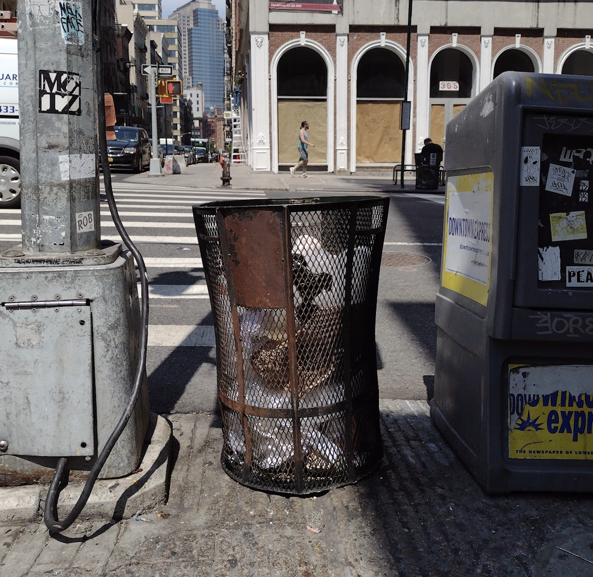

# Why trash service is crucial for public health

New York City’s modern history of public health starts in the 1600s with the Bureau of Sanitary Inspections, and ever since, sanitation has been an essential part of public health — fighting disease by keeping our city clean.



_From [A Chronology of the NYC Department of Health](https://www1.nyc.gov/assets/doh/downloads/pdf/history/chronology-1966centennial.pdf)_

## How does sanitation affect health

Proper sanitation is a crucial component of public health and of safe, health, and equitable neighborhood environments.

**Trash** can pollute our soil, water, and air, becoming an issue of health, quality of life and equity. New Yorkers live, work, and play in our public spaces: when they aren't clean, they're not welcoming, safe, healthy places for us.

Trash feeds populations of pests like **cockroaches and rats**, which can damage property, degrade housing, contaminate food, and transmit diseases. Pests can trigger asthma and other health issues. These pests are unfortunately no surprise to any New Yorker, but due to differences in sanitation, they are more prevalent in some neighborhoods than others.

In areas where unhoused people seek shelter, if there aren't **public restrooms**, then feces and urine (which are not handled by the sanitation system) become a crucial sanitation issue that affects health and quality of life.

In East Harlem, the Health Department's Bureau of Neighborhood health has been partnering with community organizations to document the lived reality of the impact of sanitation for residents. And throughout the city, the Department of Sanitation (DSNY) and City Hall are working to address sanitation concerns in ways that benefit all New Yorkers regardless of where they live.

## Everyone is entitled to clean streets

In East Harlem, street cleanliness affects people’s lives every day. In East Harlem, residents experience a lot of trash on streets and sidewalks.

Community health workers report that excess trash threatens the quality of life for those who come face-to-face with it.
 



    

        

            
        

        

        

            

                
<strong>Garbage on our streets</strong> “Our daily lives have changed as a result of the COVID-19 pandemic, especially as some social problems have become more visible than ever before. This includes the accumulation of trash in our neighborhood; the garbage is taking over. Surrounding this tree are several plastic hangers, bottles, syringes and paper scraps. This is concerning because our environment influences our health, and the accumulation of all this trash may be harmful to children. It also looks nasty. The City should increase its sanitation and cleaning services, provide more public trash bins and better educate residents about how to deal with dangerous items.” <em>- Colasa Noesis</em> 

            

        

        

    



 
These community health workers have documented concerns about trash on the streets, inadequate trash service, overflowing waste bins, sidewalk blockages, and accessibility issues. 
 



    

        

            
        

        

        

            

                
<strong>Trash overflow</strong>  “As a Community Health Worker, I face a lot of different situations while walking through the community, especially garbage overflow. In this photo, we see a lot of trash outside of the garbage bins near the entrance to NYCHA’s Johnson Houses. This creates barriers for people going in and out of their buildings, which I have experienced myself while making home visits. It also creates health concerns within the community and can make transportation difficult for people with disabilities. Finally, rats and mice are attracted to scenes like this and can often be seen running around looking for food, and that is scary!” <em>- Colasa Noesis</em> 

            

        

        

    



 

Trash on streets discourages outside play for neighborhood residents and impacts people’s mental health as they go about their everyday lives. Residents see rats scurrying around trash looking for food, which creates uneasy feelings and physical barriers to where they need to go.

No one should have to walk on sidewalks in this condition.
 



    

        

            
        

        

                    
        

        

        

            

                
<strong>Watch Your Step</strong> “Everywhere I go, from the time I step out of the train station to my workplace, and until I get home, there is dog poop everywhere. It is a gross and unsightly mess that requires you to watch your every step. When it’s not dog poop, then it’s human poop. And if it’s not poop, then it’s syringes. This is overwhelmingly depressing, especially because if you go to lower Manhattan, you do not see these things. As a community, we need more spaces where the dogs can run about and do their business and where curbing can be enforced.” <em>- Camille Clarke</em> 

            

        

        

    



---

 

## How sanitation services vary by neighborhood

New York's sanitation system is vast. It includes DSNY which is responsible for residential trash, recycling, and street cleaning; private waste haulers who pick up garbage produced by businesses; the Department of Parks and Recreation, which is responsible for trash pickups in our parks; and Business Improvement Districts (BIDs), which often fund street litter baskets (garbage cans) and additional services to help clean their neighborhood.

DSNY publishes the location of street litter baskets on [NYC Open Data](https://opendata.cityofnewyork.us/data/), which we make available here on the Environment and Health Data Portal.

In New York City, litter baskets are either wire and open at the top, or non-wired and enclosed.



    

        

            
        

        

            
        

        

        

            

                
<strong>Wire baskets</strong> are more likely to be damaged, have trash blow or fall out of them, and attract pests like rats and mice.

            

        

        

        

        

            

                
<strong>Enclosed baskets</strong> are better, protecting trash from the elements and from pests. Often, these better baskets are bought by local BIDs. Overall, <a href="https://www1.nyc.gov/site/sbs/neighborhoods/bids.page">BIDs spend over 25% of their funding on additional sanitation services in their areas</a>.

            

        

        

    



 

Often, better baskets are bought by local BIDs, which receive funding from taxes on property owners in the district. [Overall, BIDS spend over 25% of their funding on additional sanitation services in their area](https://www.nyc.gov/site/sbs/neighborhoods/bids.page). There are BIDS in many areas in the city, but none in East Harlem ([see a map of BID locations](https://data.cityofnewyork.us/Business/Business-Improvement-Districts/ejxk-d93y)). Since establishing a BID is a long and difficult process, neighborhoods with more resources are more likely to have BIDs. Also, neighborhoods can get additional trash service from elected officials. Council members can use discretionary funds to pay for more new baskets, trash service, and street and sidewalk cleaning. But these optional opportunities contribute to neighborhoods across the city having different levels of trash services.

East Harlem has very few enclosed baskets. A few blocks south on the Upper East Side, there are more litter baskets per square mile – and far more enclosed baskets.

We also see this difference between neighborhoods in data on rat inspections, with more properties north of 96th street failing inspections for rats, garbage, and harborage (conditions that provide shelter for rodents).

 


    

        

            <strong>Enclosed baskets per square mile</strong>
            <iframe title="EH / UES locator map" aria-label="Locator maps" id="datawrapper-chart-5WJ8y" src="https://datawrapper.dwcdn.net/5WJ8y/3/" scrolling="no" frameborder="0" style="width: 0; min-width: 100% !important; border: none;" height="350"></iframe>
            <a href="data-explorer/active-design/?id=2416#display=summary">Explore litter basket data here</a>.
        

        

            <strong>Rat Indexing</strong>
            <iframe title="East Harlem rat indexing" aria-label="Bar Chart" id="datawrapper-chart-ayRqE" src="https://datawrapper.dwcdn.net/ayRqE/4/" scrolling="no" frameborder="0" style="width: 0; min-width: 100% !important; border: none;" height="121"></iframe>
               
            <iframe title="Upper East Side (CD8)" aria-label="Bar Chart" id="datawrapper-chart-d7150" src="https://datawrapper.dwcdn.net/d7150/4/" scrolling="no" frameborder="0" style="width: 0; min-width: 100% !important; border: none;" height="153"></iframe>
        

    



---

 

The difference in litter baskets, garbage and rats in these two neighborhoods is just one example of the ways that sanitation varies between neighborhoods, creating very different conditions and quality of life for New York City's residents.

## What sanitation services does the city need to protect health?

City agencies are working toward comprehensive, equitable sanitation for all neighborhoods: litter baskets, trash pickup, systematic street cleaning, and services like [public restrooms where people gather.](https://www.nyc.gov/assets/designcommission/downloads/pdf/2-13-23-pres-DPR-p-PortlandLoo)

In 2022, [City Hall announced millions of dollars in new funding](https://www.nyc.gov/office-of-the-mayor/news/824-22/mayor-adams-consolidates-citywide-cleaning-functions-get-stuff-clean-14-5-million#/0) to clean neglected areas, distribute new litter baskets, and address illegal dumping. Meanwhile, DSNY has been spearheading new initiatives that transform how the city stores and collects waste. This work includes [Clean Curbs](https://www.nyc.gov/assets/dsny/site/our-work/containerized-waste-rfei), a program to get garbage bags off sidewalks and into on-street, rat-proof containers; [Better Bins](https://www.nyc.gov/assets/dsny/site/our-work/better-bin), the production of higher-quality street litter baskets; and neighborhood curbside composting programs.

In 2017, the Health Department launched the [Neighborhood Rat Reduction Initiative](https://www.nyc.gov/site/doh/health/health-topics/rats-working-in-your-community.page). Through this initiative, the Health Department collaborates with DSNY, the Department of Parks and recreation, the NYC Housing Authority, Department of Transportation, and the Department of Small Business Services to manage trash and take other steps to reduce neighborhood-level rat activity in four Rat Mitigation Zones — the newest of which is in Harlem.

All these initiatives are vital ways to increase the effectiveness of our city's sanitation system, working to build clean, healthy public spaces for New Yorkers. Neighborhoods like East Harlem and others shouldn't have to rely on discretionary funding from elected officials, or establishing Business Improvement Districts, in order to have adequate sanitation. The city needs **equitable funding and distribution of sanitation resources.**
 

## What can you do to improve sanitation in your neighborhood?

Sanitation is a long-standing issue in East Harlem, and there's a history of community organizing for better conditions. In the 1960s, the Puerto Rican activist group, the Young Lords, organized the Garbage Offensive, barricading major roads with uncollected trash to protest the City's neglect of the neighborhood and force government to address the problem.

Today, New York can help improve sanitation:

- Attend Community Board meetings — discuss your complaints with your neighbors and encourage the Community Board to take action.
- File a request on 311. You can [report rat sightings](https://portal.311.nyc.gov/article/?kanumber=KA-01107) or [missed trash service collection](https://portal.311.nyc.gov/article/?kanumber=KA-01788). These 311 reports generate complaint data that can help improve conditions in your neighborhood.

Check the Rat Information Portal [www.nyc.gov/rats](https://www.nyc.gov/site/doh/health/health-topics/rats.page) for rat inspection data or [Rat Indexing](https://www.nyc.gov/site/doh/health/health-topics/rat-maps-and-data-rat-indexing.page) for more comprehensive data.

---

 

<em>Photographs and quotes in this piece are courtesy of The Photovoice Project, a research project from the <a href="https://www1.nyc.gov/site/doh/health/neighborhood-health/harlem-health-advocacy-partners.page">Harlem Health Advocacy Partners</a>.</em>

<em>Thanks to: Giselle Guerrero (<a href="https://elbarriobikes.wixsite.com/elbarriobikes">El Barrio Bikes</a>), Philippa Godoy (We Out and <a href="https://elbarriobikes.wixsite.com/elbarriobikes">El Barrio Bikes</a>), Tara Mardigan, (<a href="https://elbarriobikes.wixsite.com/elbarriobikes">El Barrio Bikes</a> and Harlem Community Walking), and Carey King (<a href="http://uptowngrandcentral.org/">Uptown Grand Central</a> and <a href="https://elbarriobikes.wixsite.com/elbarriobikes">El Barrio Bikes</a>) for reviewing and providing feedback on this data story.</em>

<em>Special thanks to Doris Chiu for researching and writing this data story.</em>

