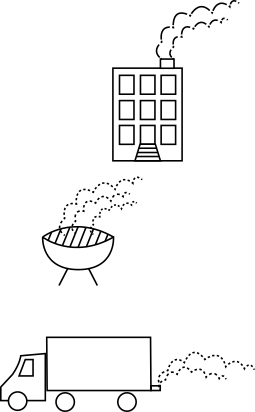

PM2.5—or fine particulate matter—are tiny particles that pollute the air and result from everyday urban activities like driving. PM2.5 can be solid or liquid in form when it is airborne. PM2.5 is the most harmful air pollution for humans to breathe in because the particles are small enough to enter the bloodstream through the lungs. Each PM2.5 particle is less than 2.5 microns in diameter. That is small enough to fit inside a red blood cell.

 

## The public health impacts of PM2.5

Once in the bloodstream, PM2.5 can cause health problems to the respiratory and circulatory systems, and even lower life expectancy. Health outcomes caused or worsened by PM2.5 include asthma, cancer, stroke, lung disease and reduced lung function, and cardiovascular disease.

    

        

            

                
            

            

                
            

        

    

## Health impacts of PM2.5 in New York City

In New York City, current overall PM2.5 levels from all sources contribute to 2,000 deaths and 5,150 emergency department visits and hospitalizations for respiratory and cardiovascular disease each year.

    

        
<h3 class="mb-3 fs-lg">1 in 140 cardiovascular hospitalizations</h3>

        
<h3 class="mb-3 fs-lg">1 in 68 respiratory hospital visits<h3>

        
<h3 class="my-3 fs-lg">1 in 28 asthma emergency room visits</h3>

        
<h3 class="my-3 fs-lg">1 in 25 deaths</h3>

    

## Traffic is a major source of PM2.5 in NYC

PM2.5 in NYC comes from inside and outside the city from all kinds of combustion activity. This includes the burning of fuel in vehicles, buildings, power plants, and construction equipment, as well as commercial cooking and industrial activities. PM2.5 can either come directly from these sources or be formed in the atmosphere from other pollutants.

<iframe title="14% of PM2.5 comes from traffic" aria-label="Donut Chart" class="my-4 "id="datawrapper-chart-8VqIl" src="https://datawrapper.dwcdn.net/8VqIl/11/" scrolling="no" frameborder="0" style="width: 0; min-width: 100% !important; border: none;" height="450" data-external="1"></iframe>

14% of the PM2.5 emitted from NYC activities comes from everyday car, bus, and truck traffic. With the prevalence of people getting more deliveries, traffic patterns are changing.

However, the health impacts of PM2.5 from traffic are still felt more acutely in less wealthy neighborhoods.

## PM2.5 pollution from traffic is not evenly distributed throughout the city

Some neighborhoods in New York City experience higher concentrations of PM2.5 from traffic than others.

    

        

            <h3>PM2.5 from trucks and buses</h3>
            
        

        

            <h3>PM2.5 from cars</h3>
            
        

        

            <i class="fas fa-square-full mr-1"></i>0.09-0.32 
            <i class="fas fa-square-full mr-1"></i>1.10-1.37
        

        

            <i class="fas fa-square-full mr-1"></i>0.33-0.56 
            <i class="fas fa-square-full mr-1"></i>1.38-1.74
        

        

            <i class="fas fa-square-full mr-1"></i>0.57-0.83  
            <i class="fas fa-square-full mr-1"></i>1.75-2.60  µg/m3
        

        

            <i class="fas fa-square-full mr-1"></i>0.84-1.09 
        

        

        

    

    <em class="fs-sm">Traffic-related PM2.5 is estimated from air quality models.</em>

## PM2.5 pollution from traffic contributes to adverse health effects

PM2.5 pollution from traffic in the NYC region contributes to an estimated 320 premature deaths and 870 emergency department (ED) visits and hospitalizations each year in New York City.

Most of these ED visits, hospitalizations, and deaths are due to PM2.5 from traffic in NYC.

<iframe title="Adverse health effects caused by PM2.5 from trucks and buses and cars" aria-label="Stacked Bars" id="datawrapper-chart-B0N7e" src="https://datawrapper.dwcdn.net/B0N7e/3/" scrolling="no" frameborder="0" style="width: 0; min-width: 100% !important; border: none;" height="219" data-external="1"></iframe>

## PM2.5-related health problems from traffic are highest in the poorest neighborhoods

PM2.5 levels from all traffic sources are about 50% higher in high poverty neighborhoods than in low poverty neighborhoods. PM2.5 levels from trucks and buses are also higher in high poverty neighborhoods than low poverty neighborhoods. The number of hospitalizations and ED visits related to pollution from traffic are highest in the poorest neighborhoods.

<iframe title="PM2.5 from traffic is highest in the poorest neighborhoods." class="my-4" aria-label="Split Bars" id="datawrapper-chart-9jmEo" src="https://datawrapper.dwcdn.net/9jmEo/1/" scrolling="no" frameborder="0" style="width: 0; min-width: 100% !important; border: none;" height="153" data-external="1"></iframe>

 

## How is your neighborhood affected?

You can find out the estimated mortality rate, hospitalizations for respiratory and cardiovascular illness rates, and emergency department visits for asthma rate for any neighborhood by entering it into the table below. You can compare these rates with poverty level to see how health impacts from traffic-related PM2.5 are differently distributed based upon income in a given neighborhood.

<iframe title="Health impacts due to PM2.5 from traffic" class="my-4" aria-label="Table" id="datawrapper-chart-atWCN" src="https://datawrapper.dwcdn.net/atWCN/2/" scrolling="no" frameborder="0" style="width: 0; min-width: 100% !important; border: none;" height="1120" data-external="1"></iframe>

<a href="https://ehjournal.biomedcentral.com/articles/10.1186/s12940-016-0172-6"> Read the full report on how PM2.5 from traffic contributes to negative health effects in New York City.</a>

