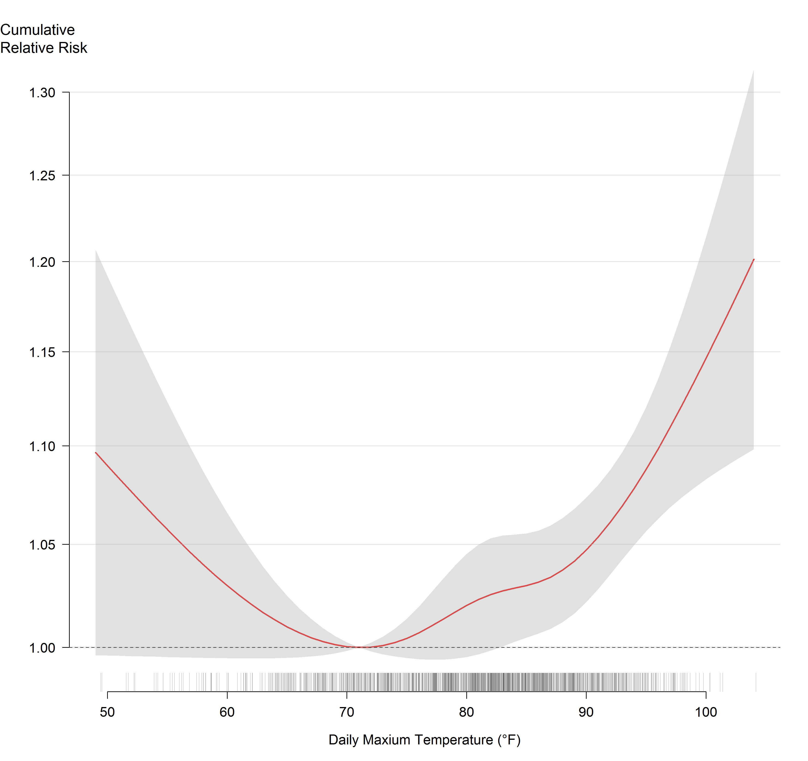

<strong>Figure 4:</strong> cumulative relative risk and 95% confidence intervals of heat-exacerbated deaths for daily maximum temperature over same-day and 3 previous days, May-September (2011-2020) 
<em>Ticks represent days at each temperature</em>
