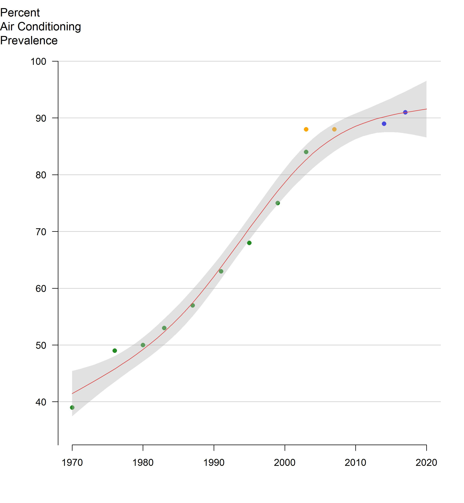

<strong>Figure 7:</strong> Air conditioning (AC) Prevalence estimated from three surveys between 1970 and 2017: American Housing Survey; New York City Community Health Survey; and Housing and Vacancy Survey.

<em>The line is fitted using natural cubic splines with 3 degrees of freedom. AHS and HVS surveys were weighted to households, whereas CHS data were weighted to individuals in the census</em>
