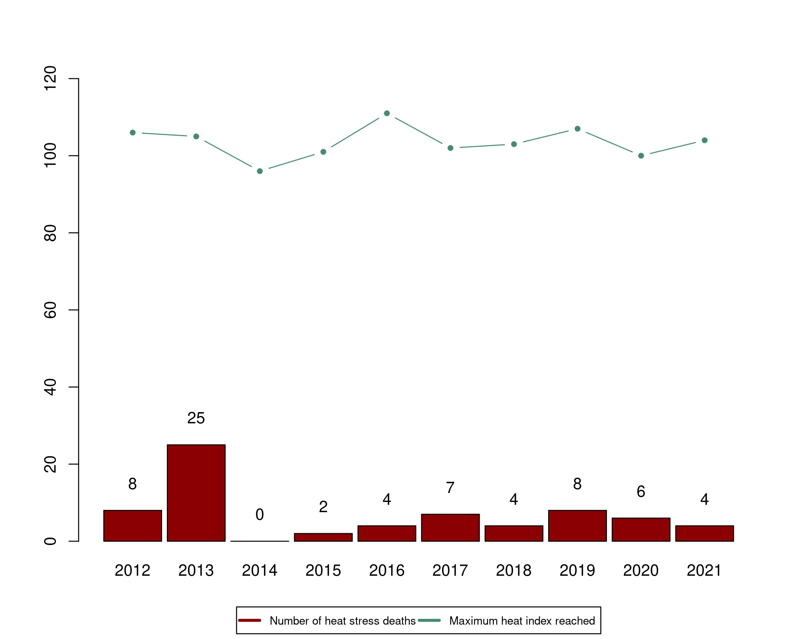
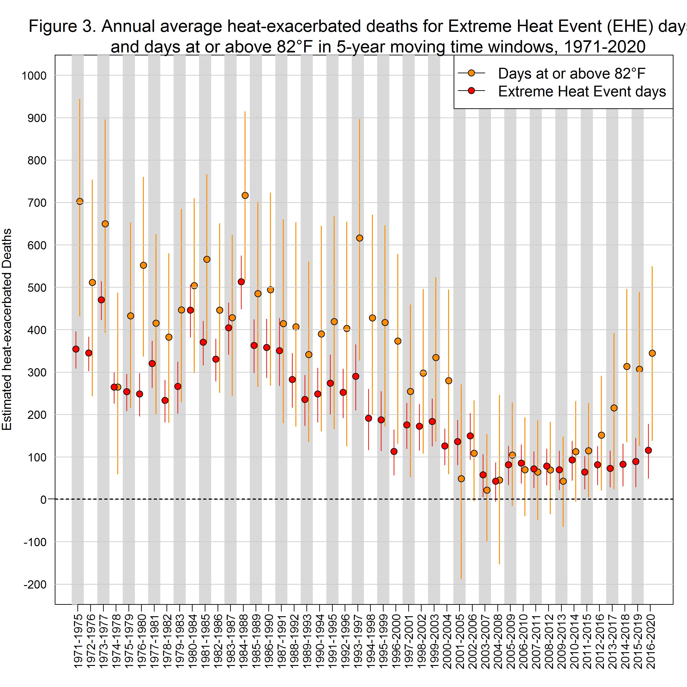
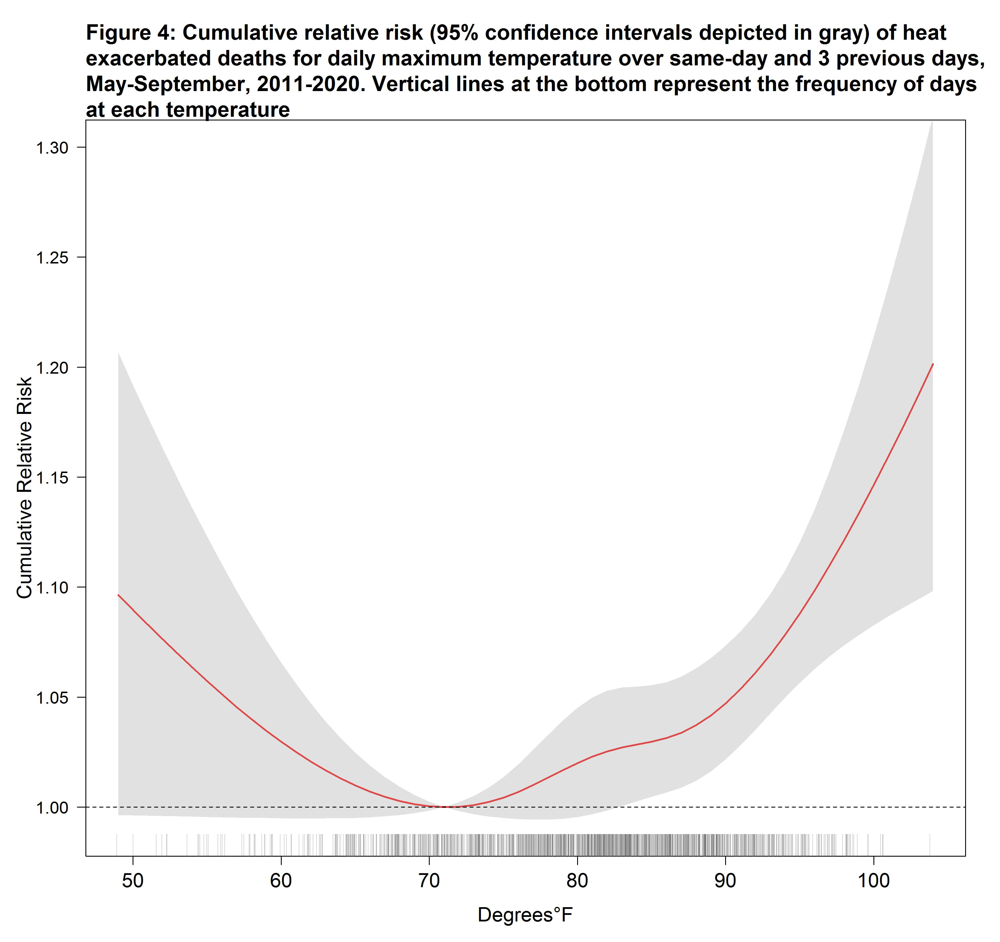
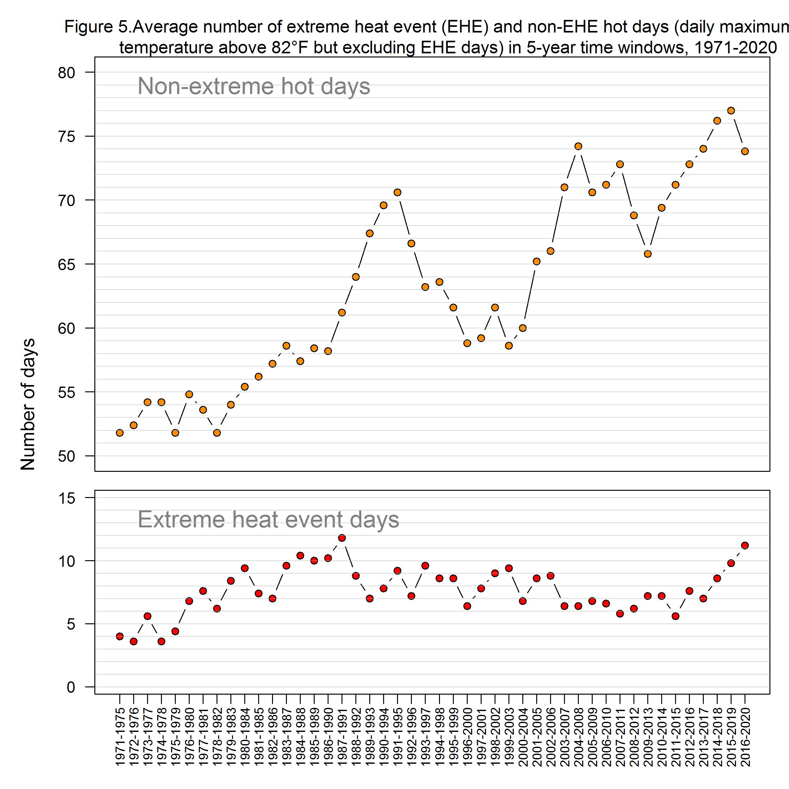
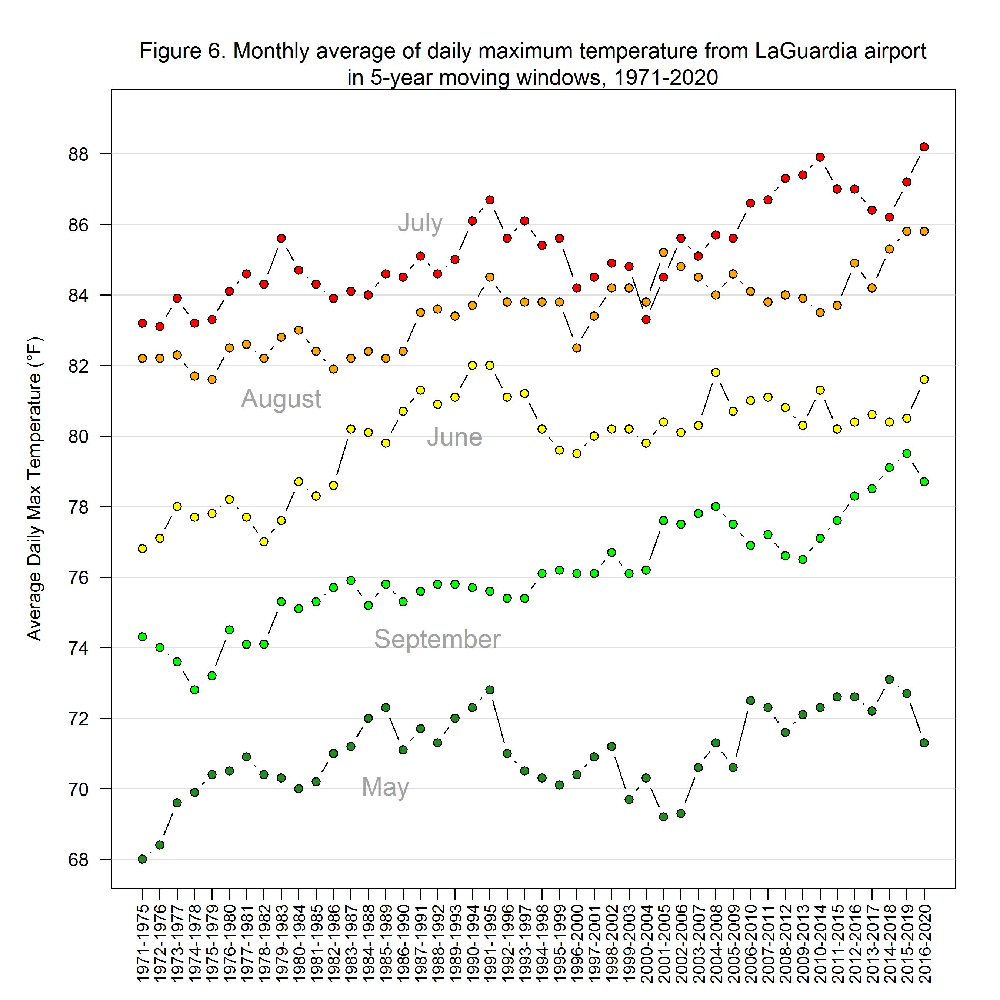
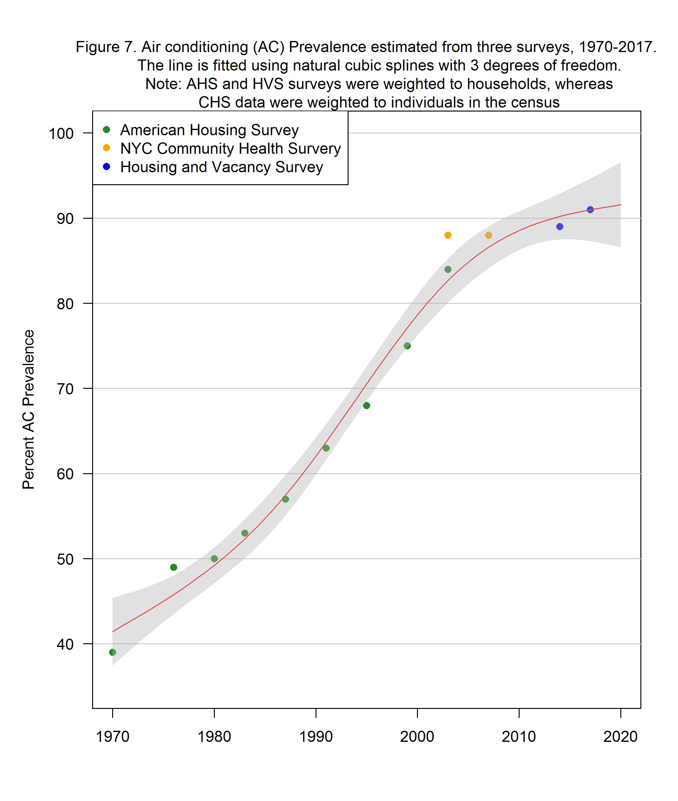

## Summary

* Each summer, on average, **an estimated 350 New Yorkers die prematurely because of hot weather** in New York City (NYC). These heat-related deaths account for about 2% of all deaths over the warm season months of May through September. Of the deaths:
  * There were an average of 7 **heat-stress deaths** annually (caused directly by heat) from 2012-2021.
  * There were an average of about 345 **heat-exacerbated deaths** (caused indirectly by heat aggravating an underlying illness) from 2016-2020.
* **Heat-exacerbated deaths have been increasing in the past decade**, mainly due to an increase in the number of non-extreme hot days. &nbsp;
* **Non-Hispanic Black New Yorkers are more likely to die from heat stress**, with death rates two times higher than White New Yorkers. This inequity is due to past and current structural racism that creates economic, health care, housing, energy, and other systems that benefit White people and disadvantage people of color. &nbsp;
* **Lack of access to home air conditioning (AC) is an important risk factor for heat-stress death**. Among those who died from heat stress, the place of death was most often an un-air-conditioned home.
* NYC summers are getting hotter because of climate change.&nbsp;**Emergency response to extreme heat must be coupled with equitable investments in systemic and structural interventions to mitigate heat-related health impacts.** For example, policies should support energy-efficient home cooling that New Yorkers can afford to run, and tree planting and greening to protect residents throughout the increasingly hot warm season weather.

---

## Introduction

Hot weather is dangerous to health, sometimes resulting in death. Heat-related deaths are preventable. In this third annual report on heat-related mortality, the Health Department examined data from 2012-2021.

We track heat-related deaths in three ways:

* **Heat-stress deaths** (also called heat stroke deaths) are caused directly by heat and happen when heat-related illnesses, such as heat exhaustion and hyperthermia, lead to death. These deaths are coded as heat-related in death certificates, and cases can be counted and investigated.
* **Heat-exacerbated deaths** happen when heat worsens existing chronic conditions, such as heart disease. These deaths are caused indirectly by heat and are estimated using statistical models. They are also often called “excess” mortality.
* **Neighborhood impacts** are tracked by looking at community-level differences in risk of heat-related death and are described using the NYC Health Department’s Heat Vulnerability Index (HVI). HVI data inputs for income, race, and surface temperature were updated and associations between the updated HVI and heat-exacerbated mortality examined. New data for neighborhood air conditioning prevalence and green space were not available.

Starting this year, we report estimated heat-exacerbated deaths for the current and past 20 years in five-year rolling time windows to characterize trends. For heat-stress deaths (caused directly by heat and therefore countable), we report counts and the annual average for the past ten years. Previous years’ reports are available here:

## Heat Stress Deaths

The Health Department examined heat-stress deaths occurring during the warm season months of May through September from 2012-2021. We reviewed death certificates and medical examiner investigation reports in cases where heat was recognized as a cause of death. A more detailed description of methods and data sources can be found here.

There were 68 heat-stress deaths among NYC residents over the 10-year period, and an average of 7 deaths per year. The largest number of annual deaths occurring earlier in the period as a result of a severe 2013 heat wave. Most deaths occurred in July (68%), followed by June (13%), August (12%), September (4%), and May (3%). As of January 2023, there were 8 heat-stress deaths in 2022, although that number is provisional and subject to change because mortality records are not finalized.&nbsp;&nbsp;

**Figure 1: Heat-stress deaths and maximum heat index by year, NYC residents, 2012-2021**&nbsp;

The number of heat-stress deaths for 2021 is provisional. If additional deaths are certified as caused by heat stress, the Department will update the number in future reports. Weather data are from the National Weather Service LaGuardia airport station. Heat index is a measure of air temperature and humidity. The largest number of annual deaths occurred in 2013 as a result of a severe heat wave.

## Demographics

* Heat-stress deaths occurred among all age groups, with the lowest rates among those aged 20 and younger and the highest among people aged 60 and older. &nbsp;
* About two thirds of heat-stress deaths occurred among men.&nbsp;
* The age-adjusted death rate among non-Hispanic Black New Yorkers is twice as high as that of non-Hispanic White New Yorkers (1.3 deaths per million versus 0.6 deaths per million) from 2012-2021, an inequity rooted in systemic racism \[1\]. Lack of equitable access to resources needed for wellness – such as jobs that pay a living wage, affordable and healthy housing with air conditioning, and health care – are causes of these differences in heat-related mortality.&nbsp;
* Death rates were higher in neighborhoods with more residents living below the federal poverty line compared to wealthier neighborhoods.&nbsp;
* Age-adjusted death rates were highest in Brooklyn.

**Figure 2: Demographic characteristics of heat-stress decedents, 2012-2021.**

<iframe title="Demographic characteristics of heat stress decedents, 2012-2012" aria-label="Bar Chart" id="datawrapper-chart-Spd0s" src="https://datawrapper.dwcdn.net/Spd0s/5/" scrolling="no" frameborder="0" style="width: 0; min-width: 100% !important; border: none;" height="765" data-external="1"></iframe>

**Note on race and ethnicity:** Deaths are grouped into five race and ethnicity categories due to the small sample size of deaths and the availability of denominator data. However, these categories represent an oversimplification of the ethnically and racially diverse population found in NYC. People identified as two or more races or races/ethnicities not listed here are included in the other or unknown category, and the Hispanic category includes people of any race. Differences in mortality rates among racial and ethnic groups are due to long-term structural racism, not biological or personal traits. Structural racism — centuries of racist policies and discriminatory practices across institutions, including government agencies, and society — prevents communities of color from accessing vital resources (such as health care and healthy housing) and opportunities (such as employment and education), and negatively affects overall health and well-being. See Appendix Methods and Supplemental Data \[**link**\] for more information on numbers and percentages by race and ethnicity.

## Health and Other Risk Factors

* Among decedents with detailed medical examiner records available, 90% had at least one chronic health condition.
* Common chronic conditions included cardiovascular disease, substance or alcohol use, serious mental health or cognitive conditions, and having a history of diabetes.

**Table 1: Medical characteristics among subset with review of health conditions in medical examiner records (n=59), 2012-2021.**

<iframe title="Health conditions table" aria-label="Table" id="datawrapper-chart-zAvcP" src="https://datawrapper.dwcdn.net/zAvcP/1/" scrolling="no" frameborder="0" style="width: 0; min-width: 100% !important; border: none;" height="387" data-external="1"></iframe>

## Heat Exposure Circumstances

People who died from heat stress were most often exposed to dangerous heat in homes (60%, n= 35 of 58 records with detailed information available about onset place). Without AC,&nbsp;[indoor temperatures can be much higher than outdoors](https://journals.ametsoc.org/view/journals/bams/99/12/bams-d-16-0280.1.xml), especially at night, and can continue for days after a heat wave \[2\]. Of those exposed in homes, and for whom there was information about the presence or absence of an AC, none had or were using AC. Another 26% (n=15) were exposed outdoors, 7% (n=4) were exposed in parked cars, and 5% (n=3) were exposed indoors at worksites. Overall, 10%(n=6) of deaths were work-related.

**Table 2: Air conditioning presence among heat stress decedents exposed to heat in homes, 2012-2021.**

<iframe title="AC status of heat stress deaths at home" aria-label="Table" id="datawrapper-chart-7F4Tg" src="https://datawrapper.dwcdn.net/7F4Tg/1/" scrolling="no" frameborder="0" style="width: 0; min-width: 100% !important; border: none;" height="210" data-external="1"></iframe>

About a third (n=12, 35%) of decedents exposed in homes had an electric fan present and on, indicating that only using an electric fan without an AC cannot always prevent death during extreme heat for people who are at highest heat risk.

Previous Health Department studies have found that air conditioning access differs across race and class. Non-Hispanic Black New Yorkers and low-income New Yorkers are less likely to own or use an AC during hot weather, and the main reason is cost [\[3\]](https://nyccas.cityofnewyork.us/nyccas2022/report/1#References). While more than 90% of NYC households currently have air conditioning, access can be as low as 76% in neighborhoods where more people are living with limited financial resources.

## Heat Exacerbated Deaths

Deaths from chronic conditions that are not recognized as heat-related on death certificates can be estimated using statistical models. They are called “excess deaths” or “heat-exacerbated deaths.” There are more of these deaths than those from heat stress. Unlike heat-stress deaths, which can be individually identified and investigated, excess deaths can be estimated only as aggregate counts. However, estimating heat-exacerbated deaths – or “mortality” – better captures the true extent of how many New Yorkers are dying of the heat.

In the previous two annual reports, we estimated heat-exacerbated mortality risk and number of deaths for a 9-year period (e.g., 2011-2019 for the 2022 report) using weather and natural cause death data for May-September in NYC. Starting this year, we report estimated heat-exacerbated deaths for the current and historical data in five-year rolling time windows to characterize trends. The average natural death count per year was about 18,000 for May through September for the most recent 5-year period (2016-2020). We used time-series statistical models to compare deaths on hot days with those on cooler days. We estimated heat-exacerbated deaths using:

* an indicator (yes/no) for extreme heat event days defined by the National Weather Service’s heat advisory threshold for NYC. Established in 2008 based on the Health Department’s heat-exacerbated mortality analysis, heat advisories are defined as at least 2 consecutive days with 95°F or higher daily maximum heat index (HI) or any day with a maximum HI of 100°F or higher.
* a range of hot daily maximum temperatures that includes both extreme heat event days and other hot days. We estimated heat-exacerbated deaths for days ranging from the median maximum daily temperature of 82°F through the highest temperature during the period.

These models were run in 5-year rolling time windows between 1971 and 2020. We included deaths occurring on the date of exposure to hot weather and over the following 3 days because previous Health Department studies have shown that heat-exacerbated deaths can occur up to 3 days after the initial hot weather \[4\]. Detailed methods used to estimate risks and attributable deaths can be found here \[insert updated link when available\].

To describe the impact of climate change, we examined how the number of hot days during warm months changed over the past five decades (1971-2020) in rolling 5-year time windows. We also computed the average of daily maximum temperature for each month between May and September to examine if changes in temperature varied by month. &nbsp;

* Historically, the estimated impacts of heat, both extreme and non-extreme hot days, declined substantially between 1971 and 2000, plateaued after 2000, and then started increasing in the past decade (see Figure 3).

* From 2016 to 2020, the most recent 5-year time window, the estimated annual average of heat-exacerbated deaths from May-September for all hot days was 345 (95% Confidence Interval \[95CI\]: 139, 549). Heat-exacerbated deaths make up approximately 2% of all natural-cause deaths in the warm months in this most recent period. Heat-exacerbated deaths at and above 82°F show an upward trend in the past decade. (See Figure 3).

* The estimated annual average of heat-exacerbated deaths associated with extreme heat events for 2016-2020 was 115 (95% CI: 50, 177). In contrast to the trend for both extreme and non-extreme hot days, heat-exacerbated deaths due to only extreme heat days are relatively constant over the past decade (see Figure 3).

* Heat-exacerbated mortality risks were observed across the full range of hot days (maximum temperature at or above 82°F) during warm season months. Examining the most recent decade 2011-2020, risk increased with temperature, with the largest increases occurring at the highest temperatures, and a steeper slope of relative risk above 90°F (see Figure 4).

* Estimated heat-attributable deaths occurred most frequently in July (37%), followed by August (28%), June (18%), September (10%), and May (7%) for 2016-2020.

 

*Hotter Summers*\*:\* There are many more days every summer that are hot but not extremely hot (i.e., daily maximum temperature at or above 82°F to single days of 95°F) compared to extreme heat event days. These days are also associated with increased risk of heat-related death (Figure 4). Due to climate change, the numbers of extreme heat events and non-extreme hot days are increasing, which contributes to an increase in heat-exacerbated deaths.

* The average number of non-extreme hot days increased from 52 in 1971-1975 to 74 days in 2016-2020, whereas the number of extreme heat days only increased from 4 in 1971-1975 to 11 in 2016-2020(See Figure 5). Based on the results presented in Figures 3 and 5,&nbsp; the increasing number of non-extreme hot days in the past decade accounts for the increase in overall heat-exacerbated deaths in the past decade.
* The average daily maximum temperature in July—the month with the highest heat-health risk—increased 5°F, from 83°F in 1971-1975 to 88°F in 2016-2020. The average daily maximum temperature in other months also increased by 3 to 5°F (see Figure 6).

Given the consistently high and increasing proportion of hot days in July and August, heat-risk mitigation planning needs to emphasize non-emergency interventions, such as access to air conditioning. According to US Census Bureau’s [American Housing Survey](https://www.census.gov/programs-surveys/ahs.html) and [Housing and Vacancy Survey](https://www.census.gov/programs-surveys/nychvs.html) conducted in New York City, air conditioning (AC) prevalence increased from ~40% in 1970 to over 80% by mid-2000 (Figure 7), likely explaining the reduction in estimated heat-exacerbated deaths in the corresponding period (Figure 3). However, the rate of increase in AC prevalence appears to have slowed since mid-2000 (Figure 7), as the number of hot days continued to increase, highlighting the urgency of achieving equitable cooling in the very near future. &nbsp; &nbsp;&nbsp;&nbsp;

  

## Community Level Impacts

The HVI shows differences in community-level heat-health impacts \[5\]. The HVI is unusual among vulnerability indices because its components have been associated with increased heat-exacerbated mortality. NYC neighborhoods with high HVI scores are those areas with more heat-exacerbated deaths. HVI scores range from 1 (lowest risk) to 5 (highest risk).

The HVI includes environmental factors with measures of a neighborhood’s average surface temperature and area percentage of green space, and social factors with measures of the percentage of homes with air conditioning, median income, and percentage of residents who are non-Hispanic Black by race stem from structural racism, which leads to neighborhood disinvestment, racist housing policies, fewer job opportunities and lower pay, and limited access to high-quality education and health care. Read more about how structural racism affects&nbsp;[housing and public health](http://a816-dohbesp.nyc.gov/IndicatorPublic/Closerlook/housing/index.html)&nbsp;and the&nbsp;[history of redlining and how it impacts public health in NYC](http://a816-dohbesp.nyc.gov/IndicatorPublic/Closerlook/redlining/index.html). The relative heat mortality risk of each&nbsp;[Neighborhood Tabulation Area (NTA](https://www1.nyc.gov/site/planning/data-maps/open-data/dwn-nynta.page)) can be explored&nbsp;[here](http://a816-dohbesp.nyc.gov/IndicatorPublic/HeatHub/hvi.html#jumpto).

We updated data for three HVI variables for which new data were available – race, income, and surface temperature – and conducted an analysis to re-examine associations between the updated HVI and heat-exacerbated mortality (refer to Appendix for more information).

<iframe title="Heat vulnerability index" aria-label="Map" id="datawrapper-chart-P5pGy" src="https://datawrapper.dwcdn.net/P5pGy/1/" scrolling="no" frameborder="0" style="width: 0; min-width: 100% !important; border: none;" height="727" data-external="1"></iframe>

 

The updated HVI continues to be associated with heat-exacerbated mortality during extreme heat and on non-extreme hot days (see Figure 8). Among the HVI components, air conditioning, race, and income had the strongest associations with heat-exacerbated mortality (see Methods appendix).&nbsp; While green space had a weak protective association compared to the other factors in the HVI, it is a critical factor in addressing the Urban Heat Island effect by lowering surface and outdoor air temperatures, providing relief from the heat through shade, and supporting a range of public health benefits beyond heat-related mortality.

<strong>Figure 8: Relative odds and 95% confidence intervals of dying on days reaching 82°F and higher by quintile of HVI, May-Sept, 2012-2019</strong>.&nbsp;

[insert figure 8]

 

 

The best indicator of&nbsp;<a href="http://a816-dohbesp.nyc.gov/IndicatorPublic/HeatHub/hvi.html">neighborhood-level heat impacts is the HVI</a> (see map 1), which shows differences in heat-exacerbated mortality risk. The number of heat stress deaths by NTA (map 2) should be interpreted with caution. The NTAs are small and the number of deaths at this level is also small and unreliable, so it is difficult to tell whether differences between areas are due to random fluctuation or because there is a difference in risk.

<iframe title="Count of heat stress deaths" aria-label="Map" id="datawrapper-chart-JmIkL" src="https://datawrapper.dwcdn.net/JmIkL/1/" scrolling="no" frameborder="0" style="width: 0; min-width: 100% !important; border: none;" height="727" data-external="1"></iframe>

 

## Conclusion

Heat contributes to the deaths of about 350 New Yorkers, on average, each year during the warm season of May through September. July accounts for the greatest share of heat-exacerbated deaths, and the average daily maximum temperature in July has increased by about 5°F in the past five decades. Deaths have been increasing over the past decade, likely due to both increasing temperatures and lagging access to home AC, particularly in communities most burdened by heat-health impacts. To prevent heat-related deaths and prepare for a hotter future, the city needs long-lasting, structural interventions alongside emergency preparedness and response.

A suite of policies is required for effective citywide heat adaptation, designed to help all New Yorkers realize the benefits of equitable cooling as they weather the effects of the climate crisis. Development will be spurred by the policy pathway to maximum temperature regulations laid out in the 2023 [PlaNYC: Getting Sustainability Done](https://climate.cityofnewyork.us/initiatives/planyc-getting-sustainability-done/) report from the Mayor’s Office of Climate and Environmental Justice. In addition, the City and state can also help ensure equitable residential cooling by:

* * Exploring regulations to require landlords to provide working air conditioning to tenants and to prohibit additional surcharges on AC use.&nbsp;
  * Providing assistance with ongoing summer utility costs through the Home Energy Assistance Program.&nbsp;
  * Prohibiting electricity disconnections during hot weather, even if bills are unpaid, so people are not exposed to dangerous heat at home and make energy prices affordable for all New Yorkers.&nbsp;
  * Supporting energy efficient home cooling and discourage excess cooling in commercial establishments.
  * Supporting affordable energy rates for low- and middle-income customers.
* Continuing to prioritize high HVI neighborhoods for heat mitigation and structural interventions, such as home cooling assistance, green infrastructure like tree planting and greening, cool roofs, and electric grid resilience to decrease risk. These measures should be coupled with housing and energy policies that help longtime neighborhood residents benefit from improvements without being priced out of the area.&nbsp;

* Supporting community-based organizations working to reduce the health impacts of heat and climate change in their neighborhoods and include them in decision-making processes about investments in their communities. Fund and provide technical assistance for community resiliency programming by local community and faith organizations, such as the Health Department’s Be a Buddy program, aimed at deepening social connections and providing individuals with access to physical and mental resources to stay safe in the heat.&nbsp;

* Continuing to strengthen emergency response measures during periods of extreme heat, such as opening cooling centers and issuing heat-health warnings, prioritizing people and communities with the greatest need for these interventions.

Learn more about what the City is doing to mitigate the effects of heat as part of [PlaNYC: Getting Sustainability Done](https://climate.cityofnewyork.us/initiatives/planyc-getting-sustainability-done/). More data and information about heat, climate, and health is also available on the Health Department’s&nbsp;[Climate and Health Hub.](http://a816-dohbesp.nyc.gov/IndicatorPublic/HeatHub/index.html)

Note on years of data included:

For heat-stress, data for 2021 and 2022 are considered preliminary because death data are still being compiled by the Bureau of Vital Statistics. These numbers may be updated in future reports as final data become available; 2021 heat-stress numbers are less likely to change. All heat-stress tables are based on heat-stress deaths from 2012-2021. The heat-exacerbated mortality analysis requires complete daily death counts to produce accurate estimates, making 2020 the most recent available year of data.

### References

1. Bailey ZD, Krieger N, Agénor M, Graves J, Linos N, Bassett MT. Structural racism and health inequities in the USA: evidence and interventions. Lancet. 2017 Apr 8;389(10077):1453-1463. doi: 10.1016/S0140-6736(17)30569-X.&nbsp;
2. Vant-Hull, B., Ramamurthy, P., Havlik, B., Jusino, C., Corbin-Mark, C., Schuerman, M., Keefe, J., Drapkin, J. K., & Glenn, A. A. (2018). The Harlem Heat Project: A Unique Media–Community Collaboration to Study Indoor Heat Waves, Bulletin of the American Meteorological Society, 99(12), 2491-2506. Retrieved Jan 30, 2023, from&nbsp;<a target="_blank" href="https://journals.ametsoc.org/view/journals/bams/99/12/bams-d-16-0280.1.xml">https://journals.ametsoc.org/view/journals/bams/99/12/bams-d-16-0280.1.xm</a>l
3. Madrigano J, Lane K, Petrovic N, Ahmed M, Blum M, Matte T. Awareness, Risk Perception, and Protective Behaviors for Extreme Heat and Climate Change in New York City. Int J Environ Res Public Health. 2018 Jul 7;15(7):1433. doi: 10.3390/ijerph15071433.
4. Metzger KB, Ito K, Matte TD. Summer heat and mortality in New York City: how hot is too hot? Environ Health Perspect. 2010 Jan;118(1):80-6. doi: 10.1289/ehp.0900906. PMID: 20056571; PMCID: PMC2831972.
5. Madrigano J, Ito K, Johnson S, Kinney PL, Matte T. A Case-Only Study of Vulnerability to Heat Wave-Related Mortality in New York City (2000-2011). Environ Health Perspect. 2015 Jul;123(7):672-8. doi: 10.1289/ehp.1408178. Epub 2015 Mar 17.