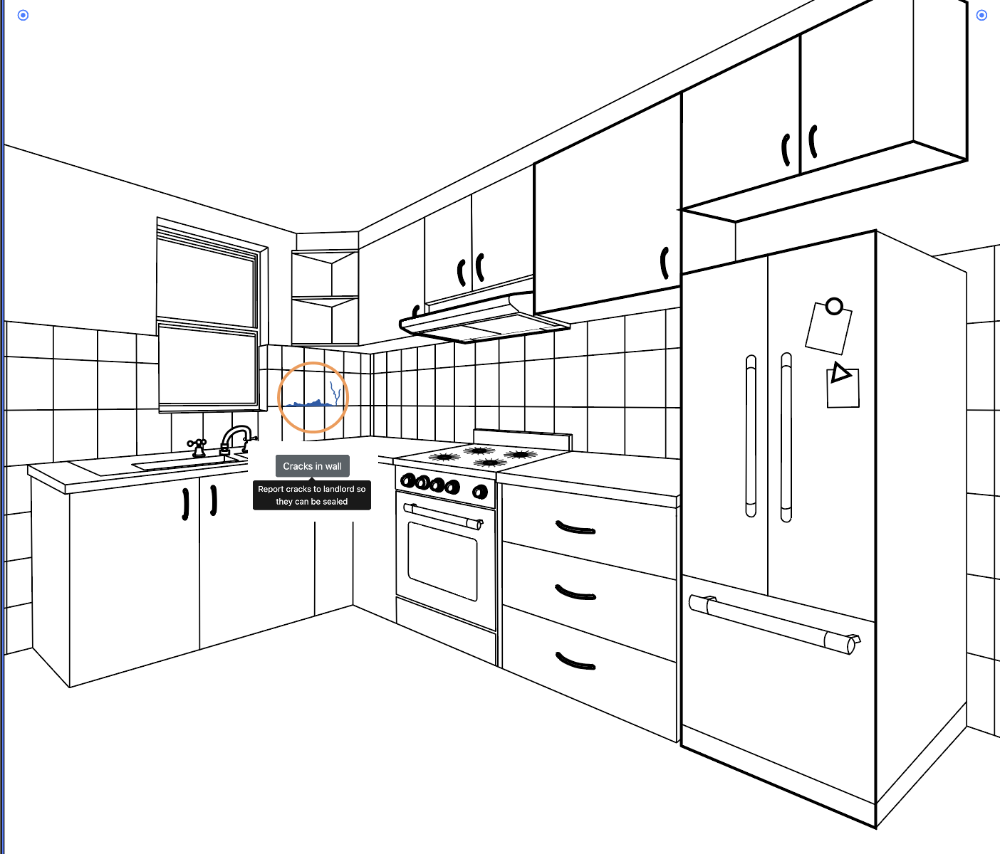

<!-- need js to enable tab selection. May need to move this to html file-->

    

    Intro text
    
 
<!-- Other format -->

  <a href="#" class="list-group-item list-group-item-action active" style="background-color: blue;" aria-current="true">
    

      <h5 class="mb-1">Peeling paint: lead poisoning hazard</h5>
      <small></small>
    

    
Report peeling paint to your landlord. If the problem is not fixed or if you think repair work is being done unsafely, call 311 to request a free inspection. Call 311 to find a provider.

    <small> </small>
  </a>
  <a href="#" class="list-group-item list-group-item-action">
    

      <h5 class="mb-1">List group item heading</h5>
      <small class="text-muted">3 days ago</small>
    

    
Some placeholder content in a paragraph.

    <small class="text-muted">And some muted small print.</small>
  </a>
  <a href="#" class="list-group-item list-group-item-action">
    

      <h5 class="mb-1">List group item heading</h5>
      <small class="text-muted">3 days ago</small>
    

    
Some placeholder content in a paragraph.

    <small class="text-muted">And some muted small print.</small>
  </a>

 
<!-- other other format -->

<h3> Option 3 </h3>

    
 
    

  

    

      <a class="list-group-item list-group-item-action active" style="background-color: blue;" id="list-home-list" data-bs-toggle="list" href="#list-home" role="tab" aria-controls="list-home">Peeling paint</a>
      <a class="list-group-item list-group-item-action" id="list-profile-list" data-bs-toggle="list" href="#list-profile" role="tab" aria-controls="list-profile">Carbon Monoxide detector</a>
      <a class="list-group-item list-group-item-action" id="list-messages-list" data-bs-toggle="list" href="#list-messages" role="tab" aria-controls="list-messages">Messages</a>
      <a class="list-group-item list-group-item-action" id="list-settings-list" data-bs-toggle="list" href="#list-settings" role="tab" aria-controls="list-settings">Settings</a>
    

  

  

    

      
Report <strong>peeling paint </strong> to your landlord. If the problem is not fixed or if you think repair work is being done unsafely, call 311 to request a free inspection.  
       Remind your provider to test your child for lead poisoning at ages 1 and 2 and ask about testing older children if you have peeling paint. <strong>Call 311 to find a provider. </strong>
 

      
 profile 

      
...

      
...

    

  

    

    

 
